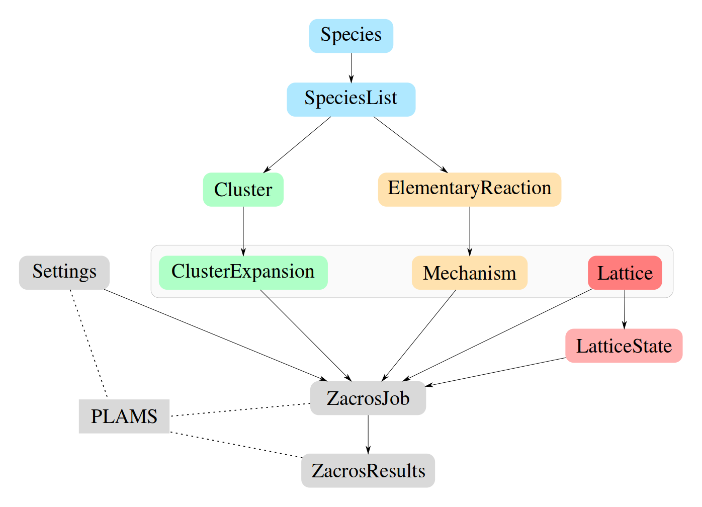

.. _components_overview:

Components overview
===================

.. note::

    In this documentation, we assume you are familiarized with both projects PLAMS and Zacros. If not, first, please
    take a look at our comprehensive documentation about PLAMS on this
    link: `PLAMS Documentation <../../plams/index.html>`_,
    and the documentation about Zacros on its official web page:
    `Zacros Website <https://zacros.org>`_

This chapter contains a description of all components (classes) that can be used within pyZacros scripts.
The image below shows all classes available in pyZacros.

The classes represented in gray boxes are extensions of PLAMS. Settings, ZacrosJob, and ZacrosResults are subclasses
of the PLAMS classes `Settings <../../plams/components/settings.html>`_,
`SingleJob <../../plams/components/jobs.html#scm.plams.core.basejob.SingleJob>`_,
and `Results <../../plams/components/results.html>`_ respectively. Thus, these classes
inherit from PLAMS the robust way of managing the inputs file preparation, job execution, file management,
and output file processing. In a nutshell, the class :ref:`Settings <settings>` is used for establishing the parameters of the
calculation. The :ref:`ZacrosJob <zacrosjob>` class is the primary piece of computational work, and it takes care of running jobs.
Finally, the :ref:`ZacrosResults <zacrosresults>` class takes care of the job results after the execution is finished; it gathers
information about output files, helps to manage them, and extracts data of interest from them.

On the other side, the rest of the classes are specifically designed to define a system in Zacros. The Zacros
package implements a Graph-Theoretical KMC on-lattice methodology coupled with cluster expansion Hamiltonians
for the adlayer energetics and Brønsted-Evans-Polanyi relations for the activation energies of elementary events.
Thus, every system in Zacros needs at least the definition of a set of clusters to evaluate the system's energy
(`ClusterExpansion <clusters.html>`_), a set of elementary events
(`Mechanism <mechanism.html>`_), a lattice representing the catalytic surface
(`Lattice <lattice.html>`_), and possibly an initial state configuration
(`LatticeState <latticestate.html>`_).

.. _use_case_model_zgb:

In the following sections, you can find the API specifications of each particular component, an explanation of its
role in the whole environment, and one example of usage. In particular, we will explain the different components
using as a use case the following example, which is known as the
`Ziff-Gulari-Barshad (ZGB) Model <https://zacros.org/tutorials/4-tutorial-1-ziff-gulari-barshad-model-in-zacros>`_:

.. image:: ../../images/reaction_example.png
   :scale: 60 %
   :align: center

The ZGB model includes:

* Three gas species (CO, O\ :sub:`2`, and CO\ :sub:`2`), and three surface species (\*, CO\*, O\*).
* A lattice with a single site type.
* Two clusters: The CO* and O* individual adsorbates.
* Three irreversible events:

  1) Non-dissociative adsorption of CO
  2) Dissociative adsorption of O\ :sub:`2`
  3) Fast reaction between an O adatom and a CO adsorbate to produce CO\ :sub:`2`

.. toctree::
    :maxdepth: 1

    species
    lattice
    cluster
    mechanism
    latticestate
    settings
    zacrosjob
    zacrosresults
