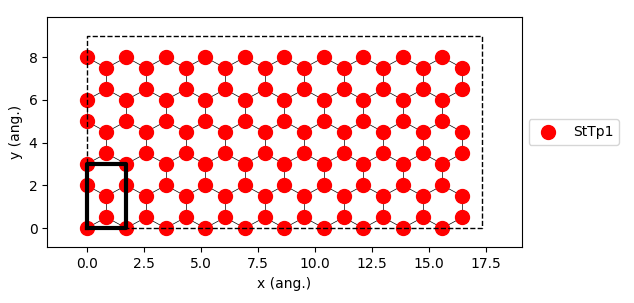

.. _lattice:

Lattice
-------

The Lattice class defines the lattice structure on which species can bind, diffuse and react. There
are several ways to specify the lattice structure. They are defined in a correspondence one-to-one
with the conventions used in the Zacros' input files. See the API section below for a detailed description
of these three ways: 1) Default Lattices, 2) Unit-Cell-Defined Periodic Lattices, and 3) Explicitly Defined Custom Lattices.

Following our example (see :ref:`use case system <use_case_model_zgb>`), we just need a single-site lattice with
a coordination number of 3, a lattice constant equal to ``1.0``, and a modest number of copies of the unit cell ``10x3``:

.. code-block:: python
  :linenos:

  # Lattice setup
  lat = pz.Lattice( lattice_type=pz.Lattice.TRIANGULAR,
                    lattice_constant=1.0, repeat_cell=[10,3] )

  print(lat)

  lattice.plot()

The previous lines produce the following output:

.. code-block:: none

   lattice default_choice
   triangular_periodic 1.0 10 3
   end_lattice

In addition to the capabilities of building lattices, pyZacros also offers a way to visualize them by calling
the function ``plot()``. e.g., see line 7 of the script above. This line produces the following figure:

API
~~~

.. currentmodule:: scm.pyzacros.core.Lattice
.. autoclass:: Lattice
  :exclude-members: __init__, __str__, __weakref__, _Lattice__fromDefaultLattices, _Lattice__fromExplicitlyDefined, _Lattice__fromUnitCellDefined
