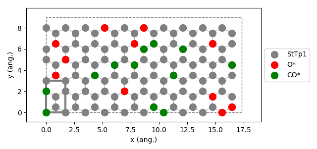

.. _latticestate:

LatticeState
------------

A significant result from a KMC simulation is how the different sites in the lattice are populated as a function of time.
During a Zacros simulation, Zacros takes snapshots of the lattice state and writes them in the file ``history_output.txt``.
Parallelly pyZacros stores each snapshot as a ``LatticeState`` object (see ZacrosResults) for further analysis and/or use
on the python side. Another important application of LatticeState objects is that they can be used as initial states, either
as objects from a previous simulation or built from scratch.

For our example (see :ref:`use case system <use_case_model_zgb>`), we will use the ``LatticeState`` class to build a
lattice state from scratch, and use it as the initial state.

.. note::

    pyZacros (and Zacros) will start with an empty lattice if not stated otherwise.

We are going to make the initial state as a randomly populated lattice by ``CO*`` and ``O*`` with a given coverage:

.. code-block:: python
  :linenos:

  # LatticeState setup (initial state)
  ist = pz.LatticeState(lat, surface_species=spl.surface_species())
  ist.fill_sites_random(site_name='StTp1', species='CO*', coverage=0.1)
  ist.fill_sites_random(site_name='StTp1', species='O*', coverage=0.1)

  print(ist)

  ist.plot()

Similarly to the other classes, the function ``print()`` (see line 6) allows taking a look at the Zacros code that
will be internally generated, which for this example is the following:

.. code-block:: none

      initial_state
        # species * CO* O*
        # species_numbers
        #   - CO*  12
        #   - O*  11
        seed_on_sites CO* 1
        seed_on_sites CO* 4
        seed_on_sites O* 6
        seed_on_sites O* 10
        seed_on_sites O* 20
        seed_on_sites CO* 30
        seed_on_sites CO* 43
        seed_on_sites O* 48
        seed_on_sites O* 52
        seed_on_sites CO* 55
        seed_on_sites O* 58
        seed_on_sites CO* 62
        seed_on_sites CO* 69
        seed_on_sites CO* 70
        seed_on_sites O* 72
        seed_on_sites CO* 73
        seed_on_sites CO* 78
        seed_on_sites CO* 93
        seed_on_sites O* 99
        seed_on_sites O* 106
        seed_on_sites O* 109
        seed_on_sites O* 110
        seed_on_sites CO* 115
      end_initial_state

Please consult Zacros' user guide (``$AMSHOME/scripting/scm/pyzacros/doc/ZacrosManual.pdf``) for more details about the specific meaning of the keywords used in the previous lines.

Finally, to visualize the lattice you can make use of the function ``plot()`` (see line 8). The result is as follows:

.. note::

    To visualize the previous figure, be sure you have `matplotlib <https://matplotlib.org/>`_ installed.

API
~~~

.. currentmodule:: scm.pyzacros.core.LatticeState
.. autoclass:: LatticeState
   :exclude-members: __init__, __str__, __weakref__, _updateSpeciesNumbers
