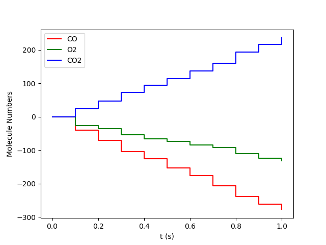
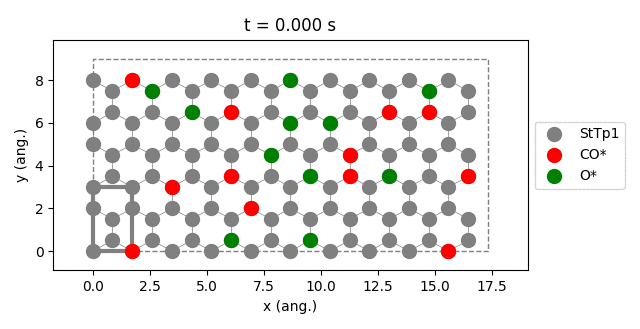
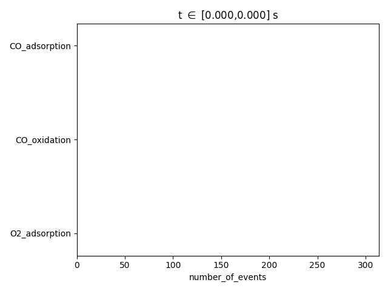

ZacrosResults
-------------

For an explanation purpose let us assume that ``/home/user/xyz`` contains three files: ``ammonia.xyz``, ``ethanol.xyz``, ``water.xyz``.
When you run this script the standard output will look something like:

.. code-block:: python
  :linenos:

   results = job.run()

   if( job.ok() ):
      provided_quantities = results.provided_quantities()
      print("nCO2 =", provided_quantities['CO2'])

      results.plot_molecule_numbers( results.gas_species_names() )
      results.plot_lattice_states( results.lattice_states() )

      pstat = results.get_process_statistics()
      results.plot_process_statistics( pstat, key="number_of_events" )

For an explanation purpose let us assume that ``/home/user/xyz`` contains three files: ``ammonia.xyz``, ``ethanol.xyz``, ``water.xyz``.
When you run this script the standard output will look something like:

.. code-block:: none

   [05.11|10:22:27] JOB plamsjob STARTED
   [05.11|10:22:27] JOB plamsjob RUNNING
   [05.11|10:22:27] JOB plamsjob FINISHED
   [05.11|10:22:27] JOB plamsjob SUCCESSFUL
   nCO2 = [0, 28, 57, 85, 118, 139, 161, 184, 212, 232, 264]
   [05.11|10:22:27] PLAMS run finished. Goodbye

.. code-block:: python

   results.plot_molecule_numbers( results.gas_species_names() )

.. code-block:: python

   results.plot_lattice_states( results.lattice_states() )

.. code-block:: python

   pstat = results.get_process_statistics()
   results.plot_process_statistics( pstat, key="number_of_events" )

API
~~~

.. currentmodule:: scm.pyzacros.core.ZacrosResults
.. autoclass:: ZacrosResults
    :exclude-members: _ZacrosResults__plot_process_statistics

