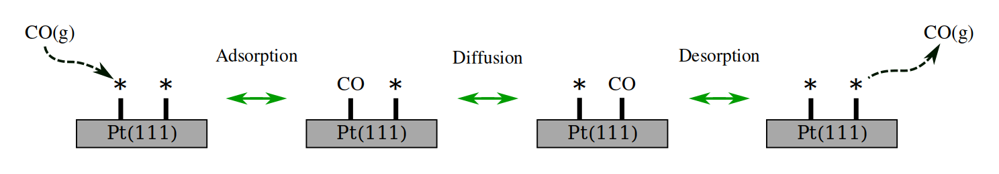
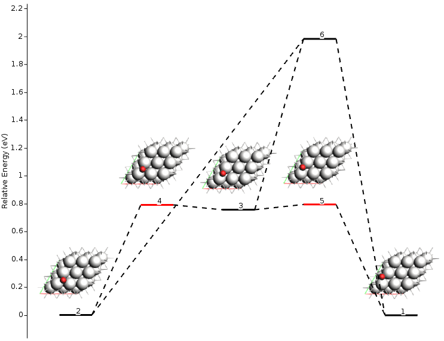
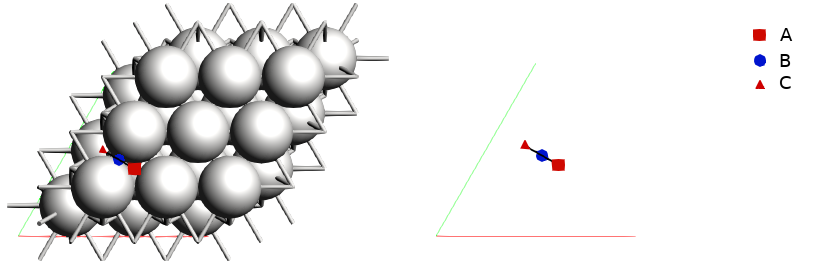
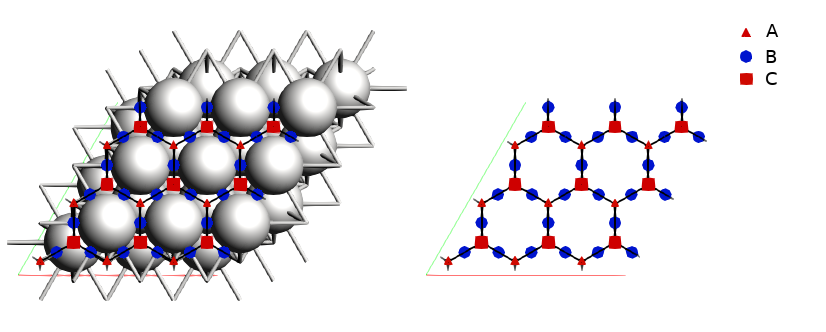
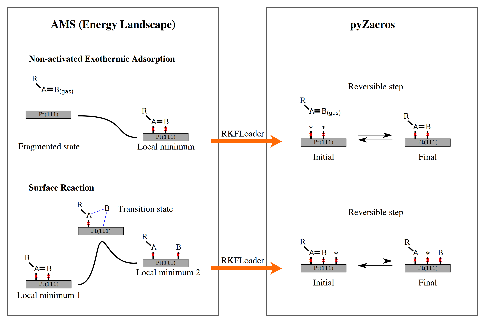
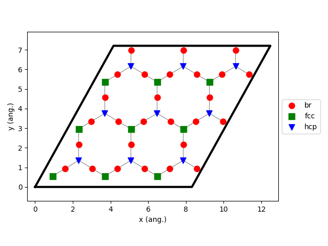
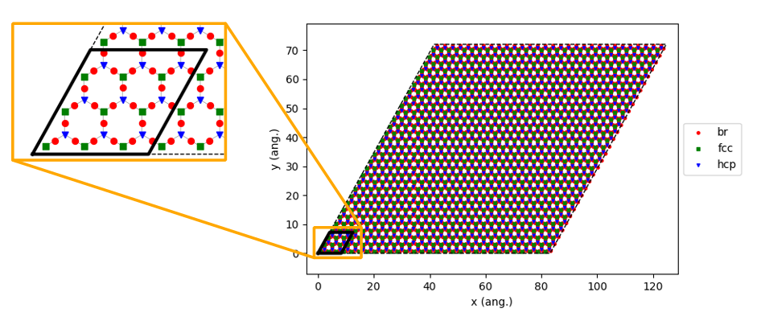
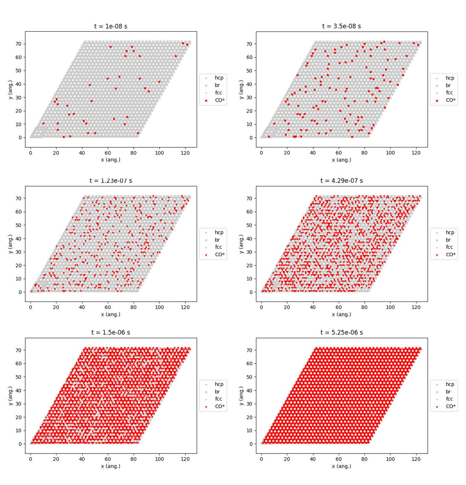
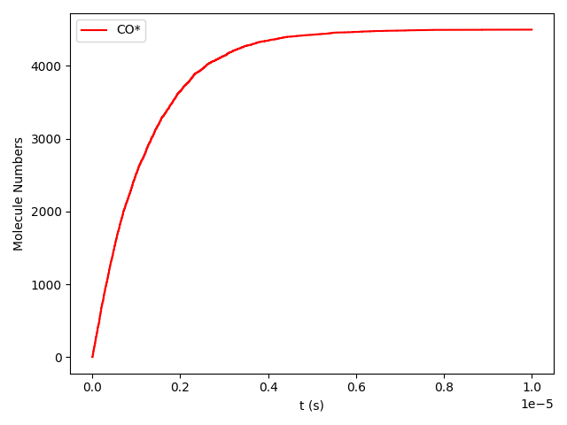

Poisoning of Pt(111) by CO: From atomistic to mesoscopic modeling
-----------------------------------------------------------------

.. note::
  This example script uses computational engines from the Amsterdam Modeling Suite, and you will need a license to run them. Contact license@scm.com for further questions.

  In order to run the example, the ``AMSBIN`` environment variable should be properly set. You can test this by typing ``$AMSBIN/plams -h`` in a terminal: this should print PLAMS' help message. If this is not the case (e.g. you get 'No such file or directory'), you need to set up the environmental variable ``$AMSBIN`` (see the `Linux Quickstart guide <../../Installation/Linux_Quickstart_Guide.html>`__ for details).

This example illustrates a procedure for simulating molecular phenomena on catalytic surfaces, starting from an atomic-level description up to a mesoscopic regime in an automated way and with the lowest human supervision possible. We follow the strategy based on the intercommunication and cooperation of the three packages AMS-driver (hereafter AMS for shorter), EON, and Zacros. The full workflow is carried out in python.

From the technical point of view, EON is combined with AMS at the source code level, and they work together transparently from an AMS user point of view (see PESExploration in the input file). On top of that, we used the PLAMS library to access AMS from python. On the other side, Zacros is coupled through pyZacros that generates the pyZacros objects from the AMS/EON results, run the calculation, and parse the output files to get back the calculation results to the python interface.

From the physical/chemical point of view, AMS is used to explore the energy landscape of the system by using specialized algorithms. Additionally, it processes the obtained energy landscape to calculate the binding sites and their interconnections. Finally, pyZacros translates this information to clusters, mechanisms, and binding-sites lattices (building blocks of a Zacros calculation) and runs the KMC (Kinetic Monte-Carlo) simulation to perform dynamic modeling of adsorption, desorption, surface diffusion, and/or reaction processes. Everything from a simple python script!

The example we show here is a toy model system for the adsorption and diffusion of carbon monoxide on the Pt(111) surface. We are not interested in an accurate description of the system itself. We are interested in studying a simple and computationally cheap design to start with and illustrate all possible issues we can face during the automation process. In particular, we will not consider any lateral interaction energy correction among CO molecules at this stage. The simulation described here basically shows the poisoning process of Pt(111) by CO.

This example shows how to conduct a Kinetic Monte-Carlo simulation of CO interacting with Pt(111) surface, starting from its atomic representation. To that aim, we use a 3x3 Pt(111) surface to avoid artificial lateral interactions between the CO and its periodic images. Here, it is essential to point out that both the adsorption-sites and the reaction mechanisms will be automatically obtained from the results of the AMS calculation and translated appropriately to Zacros. There is not any predefined knowledge about the system. The expected mechanisms are sketched in the following figure.

As we said before, the only necessary information from the system is an initial guess for its geometry. We used the AMS GUI for this. Here we do not show details on how to do that, so please refers to our GUI's documentation. In a nutshell, we generated a 3x3 Pt(111) surface, put a CO molecule on top of it, and optimized the geometry by keeping the whole Pt(111) surface frozen. Additionally, we created two regions, namely 'adsorbate' and 'surface.' The former for the CO atoms and the latter for the atoms of the platinum surface.

To make this example reproducible, we provide the geometry in ``XYZ`` format. See the figure below.

.. |co_pt111_xyz| image:: ../../images/example_CO+Pt111-initxyz.png
   :scale: 60 %

.. csv-table::
   :header: |co_pt111_xyz|

   "Link to download: :download:`CO_ads+Pt111.xyz <CO_ads+Pt111.xyz>`"

.. Note::
  If you prepare the initial geometry yourself, keep in mind that you can start from a different geometry, and the final results should be identical. The only requirements are to select a local minimum, create the corresponding regions (``adsorbate`` and ``surface``), and orient the Pt surface to maximize the number of symmetry operations. In the geometry we provide above, the Pt surface is oriented such that it belongs to the P-3m1 (164) symmetry space group.

Now, you can download the complete example script from this link :download:`CO+Pt111.py <CO+Pt111.py>`. Hereafter, we briefly explain the different sections of the code.

The script starts as follows:

.. code-block:: python
  :linenos:

  import scm.plams
  import scm.pyzacros

  mol = scm.plams.Molecule( 'CO_ads+Pt111.xyz' )

  scm.plams.init()

Firstly we load the required python libraries: PLAMS and pyZacros (lines 1-2). Then, we create a PLAMS molecule using the XYZ geometry file we provided above (line 4). Take note that the molecule automatically includes the information about regions that are described in the XYZ file. Finally, we start the PLAMS environment (line 6).

It is convenient to divide our script into four sections for clarity. In the first one (:ref:`getting_energy_landscape`), we will obtain the symmetry's irreducible energy landscape for this system, which will indirectly allow us to define the associated reaction mechanisms and the cluster expansion Hamiltonian. In the second one (:ref:`getting_kmc_lattice`), we will get the KMC lattice, which requires applying all symmetry operators of the Pt surface. In the third one (:ref:`generating_pyzacros_objects`), we will use this information to create the corresponding pyZacros to finally, in the fourth one (:ref:`running_pyzacros_simulation`), run the KMC simulation itself.

.. _getting_energy_landscape:

Getting the Energy Landscape
============================

This section aims to get the energy landscape of the system, but by being careful of getting only the states that are irreducible by symmetry. This requirement significantly reduces the computational effort of the calculation and simplifies the analysis of the obtained results. This section references the section of code shown below:

.. code-block:: python
  :linenos:
  :lineno-start: 8

  engine_sett = scm.plams.Settings()
  engine_sett.input.ReaxFF.ForceField = 'CHONSFPtClNi.ff'
  engine_sett.input.ReaxFF.Charges.Solver = 'Direct'

  sett_ads = scm.plams.Settings()
  sett_ads.input.ams.Constraints.FixedRegion = 'surface'
  sett_ads.input.ams.Task = "PESExploration"
  sett_ads.input.ams.PESExploration.Job = 'ProcessSearch'
  sett_ads.input.ams.PESExploration.RandomSeed = 100
  sett_ads.input.ams.PESExploration.NumExpeditions = 10
  sett_ads.input.ams.PESExploration.NumExplorers = 4
  sett_ads.input.ams.PESExploration.SaddleSearch.MaxEnergy = 2.0
  sett_ads.input.ams.PESExploration.DynamicSeedStates = True
  sett_ads.input.ams.PESExploration.CalculateFragments = True
  sett_ads.input.ams.PESExploration.StatesAlignment.ReferenceRegion = 'surface'
  sett_ads.input.ams.PESExploration.StructureComparison.DistanceDifference = 0.1
  sett_ads.input.ams.PESExploration.StructureComparison.NeighborCutoff = 2.5
  sett_ads.input.ams.PESExploration.StructureComparison.EnergyDifference = 0.05
  sett_ads.input.ams.PESExploration.StructureComparison.CheckSymmetry = True
  sett_ads.input.ams.PESExploration.BindingSites.Calculate = True
  sett_ads.input.ams.PESExploration.BindingSites.NeighborCutoff = 3.8

  job = scm.plams.AMSJob(name='pes_exploration', molecule=mol, settings=sett_ads+engine_sett)
  results_ads = job.run()

  energy_landscape = results_ads.get_energy_landscape()
  print(energy_landscape)

This code basically setup a PESExploration calculation using AMS and run it. We will describe the most relevant options in this context. For more information, please refers to our AMS user's manual.

Lines 8-10 select the engine to use. Here we chose the reactive force field (ReaxFF) method in combination with the parameterization 'CHONSFPtClNi.ff,' which has been specially designed to study the surface oxidation of Pt(111).

Lines 12-28 specify the PESExploration task settings. The results of this calculation are the set of critical points that compose the energy landscape, what we call the energy landscape for short. Here we fix the position of the platinum surface atoms (line 13), use the ProcesSearch method to find the escape mechanisms from the different states (line 15), distributed in 10 expeditions with 4 explorers each (lines 17-18), and allow transition states within a 2 eV energy window (line 19). Any newfound local minimum is used as the origin of a new expedition (line 20). For the final set of local minima found, a geometry optimization of the corresponding independent fragments (CO and Pt surface) is carried out to consider the gas-phase configurations into the energy landscape (line 21). The two fragments are defined as 1) the atoms belonging to the reference region; the Pt surface, and 2) the rest, equivalently to the adsorbate atoms. Additionally, all obtained states will be aligned with respect to this reference (line 22).

For the structure comparison, we establish that the structures are considered the same if their interatomic distances are less than 0.1 A in neighborhoods of 2.5 A and energy differences are less than 0.05 eV (lines 23-25). Additionally, we verify that molecules are irreducible by the symmetry operations of the Pt surface (line 26).

For illustration purposes, we require the calculation of the binding sites (line 27), where their labels are set based on the number of the neighbor atoms within a distance of 3.8 A (line 28). A lower value for NeighborCutoff may conduct to make fcc and hcp sites indistinguishable, i.e. they will get assigned the same label.

Finally, we create the AMSJob calculation, which requires both the initial molecule and the settings object as input parameters(line 30), and we run it (line 31). This calculation should take only a few minutes. Once this calculation is finished, we print out the obtained energy landscape (lines 33-34). If everything went well, at this point, you should get something like this in the standard output:

.. code-block:: none
  :linenos:

  [05.02|08:15:06] PLAMS working folder: /home/user/pyzacros/examples/CO+Pt111/plams_workdir
  [05.02|08:15:06] JOB pes_exploration STARTED
  [05.02|08:15:06] JOB pes_exploration RUNNING
  [05.02|08:15:51] JOB pes_exploration FINISHED
  [05.02|08:15:51] JOB pes_exploration SUCCESSFUL
  All stationary points:
  ======================
  State 1: COPt36 local minimum @ -7.65164210 Hartree (found 1 times, results on State-1_MIN)
  State 2: COPt36 local minimum @ -7.65157184 Hartree (found 1 times, results on State-2_MIN)
  State 3: COPt36 local minimum @ -7.62381952 Hartree (found 1 times, results on State-3_MIN)
  State 4: COPt36 transition state @ -7.62254756 Hartree (found 5 times, results on State-4_TS_2-3)
    +- Reactants: State 2: COPt36 local minimum @ -7.65157184 Hartree (found 1 times, results on State-2_MIN)
       Products:  State 3: COPt36 local minimum @ -7.62381952 Hartree (found 1 times, results on State-3_MIN)
       Prefactors: 1.586E+13:2.362E+12
  State 5: COPt36 transition state @ -7.62242984 Hartree (found 3 times, results on State-5_TS_3-1)
    +- Reactants: State 3: COPt36 local minimum @ -7.62381952 Hartree (found 1 times, results on State-3_MIN)
       Products:  State 1: COPt36 local minimum @ -7.65164210 Hartree (found 1 times, results on State-1_MIN)
       Prefactors: 2.205E+12:1.504E+13
  Fragment 1: CO local minimum @ -0.42445368 Hartree (results on Fragment-1)
  Fragment 2: Pt36 local minimum @ -7.154286 Hartree (results on Fragment-2)
  FragmentedState 1: CO+Pt36 local minimum @ -7.57874007 Hartree (fragments [1, 2])
    +- State 1: COPt36 local minimum @ -7.65164210 Hartree (found 1 times, results on State-1_MIN)
    |  Prefactors: 8.051E+06:1.668E+16
    +- State 2: COPt36 local minimum @ -7.65157184 Hartree (found 1 times, results on State-2_MIN)
    |  Prefactors: 8.051E+06:1.642E+16
    +- State 3: COPt36 local minimum @ -7.62381952 Hartree (found 1 times, results on State-3_MIN)
       Prefactors: 8.051E+06:2.446E+15

From this output information, we can see that the calculation took less than a minute (lines 1-5) and that the obtained energy landscape contains three local minima (lines 8-10), two transition states (lines 11-18), and one fragmented state (lines 21-27). Notice there is more information available there, like absolute energies, the connections between local minima and transition states, and preexponential factors. To get a more amicable and interactive visualization of the energy landscape, you can use our amsmovie tool by executing the following command:

.. code-block:: none

   $ amsmovie plams_workdir/pes_exploration/ams.rkf

.. Note::
  AMS currently only supports non-activated exothermic adsorption (X\ :sub:`gas` + * ⟷ X*) and surface reactions (X*+Y* ⟷ Z*) processes.

To visualize the binding sites you can use our tool amsinput as follows:

.. code-block:: none

   $ amsinput plams_workdir/pes_exploration/ams.rkf

Note that AMS detected three binding sites, labeled as A, B, and C. In literature, they are commonly labeled as fcc, bridge, and hcp, respectively; we will fix that later. What is important is that they were detected automatically without any preconceived idea of the system!

.. _getting_kmc_lattice:

Getting the KMC Lattice
=======================

In the previous section, we obtained both the energy landscape and the associated binding sites but the irreducible symmetry representation. On the other hand, in this section, we are interested in generating all symmetry-related images based on the previous results. That's the aim of the next part of the script, which is as follows:

.. code-block:: python
  :linenos:
  :lineno-start: 36

  sett_bs = sett_ads.copy()
  sett_bs.input.ams.PESExploration.LoadEnergyLandscape.Path= '../pes_exploration'
  sett_bs.input.ams.PESExploration.NumExpeditions = 1
  sett_ads.input.ams.PESExploration.NumExplorers = 1
  sett_bs.input.ams.PESExploration.GenerateSymmetryImages = True
  sett_bs.input.ams.PESExploration.CalculateFragments = False
  sett_bs.input.ams.PESExploration.StructureComparison.CheckSymmetry = False

  job = scm.plams.AMSJob(name='binding_sites', molecule=mol, settings=sett_bs+engine_sett)
  results_bs = job.run()

Here, we start from the settings object of the previous calculation (line 36) and load its energy landscape information (line 37). We selected both the number of expeditions and the number of explorers to 1 because we are not interested in running a new exploration process of the energy landscape. Instead, we want to generate the symmetry-related images activated by using the option ``PESExploration%GenerateSymmetryImages`` (line 40) and deactivating the option ``PESExploration.StructureComparison.CheckSymmetry`` (line 42). We deactivated ``PESExploration%CalculateFragments`` to save a bit of computational time (line 41). Then, we create the AMSJob calculation, using the same initial molecule and the new settings object (line 44), and run it (line 45). This calculation creates the images by applying the symmetry operators from the surface to the adsorbent's atoms and optimizing the new geometry afterward. Transition states are optimized using the dimer method. If everything went well, at this point, you should get something like this in the standard output:

.. code-block:: none
  :linenos:

  [05.02|08:15:51] JOB binding_sites STARTED
  [05.02|08:15:51] JOB binding_sites RUNNING
  [05.02|08:16:16] JOB binding_sites FINISHED
  [05.02|08:16:16] JOB binding_sites SUCCESSFUL

Notice that the calculation took less than a minute (lines 1-4). To visualize the binding sites you can use again amsinput:

.. code-block:: none

   $ amsinput plams_workdir/binding_sites/ams.rkf

Now we have the full KMC lattice corresponding to the 3x3 Pt(111) surface with all the right links in the borders satisfying the periodic boundary conditions.

.. _generating_pyzacros_objects:

Generating the pyZacros objects
===============================

In the previous sections, we obtained the irreducible-symmetry energy landscape and the complete lattice of binding sites. These results have to be post-processed to generate the cluster expansion Hamiltonian, the reaction mechanism, and the KMC lattice in the pyZacros/Zacros scheme. pyZacros offers a way to do this through the class ``RKFLoader``. This class receives a Results object in the constructor and makes available the expected objects already translated into the pyZacros scheme, namely: mechanism, clusterExpansion, and lattice. The following figure is a schematic representation of reaction processes as defined in AMS and pyZacros, and how the RKFLoader class translates them from one to the other:

In this figure, red crosses represent the binding sites. A and B are the atoms attached to the binding sites (parent atoms), and R is the remainder of the adsorbed molecule. Remember that AMS currently only supports non-activated exothermic adsorption (X\ :sub:`gas` + * ⟷ X*) and surface reactions (X*+Y* ⟷ Z*) processes.

The following section of the script shows how to use the RKFLoader object and access the corresponding translated objects in pyZacros. It also shows the way to replace the binding sites' labels for the appropriated ones (fcc, be, and hcp):

.. code-block:: python
  :linenos:
  :lineno-start: 47

  loader_ads = scm.pyzacros.RKFLoader( results_ads )
  loader_ads.replace_site_types_names( ['A','B','C'], ['fcc','br','hcp'] )
  loader_bs = scm.pyzacros.RKFLoader( results_bs )
  loader_bs.replace_site_types_names( ['A','B','C'], ['fcc','br','hcp'] )

  print(loader_ads.clusterExpansion)
  print(loader_ads.mechanism)
  print(loader_bs.lattice)
  loader_bs.lattice.plot()

Additionally, line 51 should print out the cluster expansion in the zacros format as follows:

.. code-block:: none

  energetics

  cluster CO*-fcc
    sites 1
    lattice_state
      1 CO* 1
    site_types fcc
    graph_multiplicity 1
    cluster_eng -1.98185e+00
  end_cluster

  ...
  end_energetics

... line 53 the mechanism:

.. code-block:: none

  mechanism

  reversible_step CO*_0-fcc,*_1-br<-->*_0-fcc,CO*_1-br;(0,1)
    sites 2
    neighboring 1-2
    initial
      1 CO* 1
      2 * 1
    final
      1 * 1
      2 CO* 1
    site_types fcc br
    pre_expon  1.58623e+13
    pe_ratio  6.71496e+00
    activ_eng  7.89791e-01
  end_reversible_step

  ...
  end_mechanism

... line 54 the lattice:

.. code-block:: none

  lattice periodic_cell
    cell_vectors
      8.31557575    0.00000000
      4.15778787    7.20149984
    repeat_cell 1 1
    n_site_types 3
    site_type_names br fcc hcp
    n_cell_sites 45
    site_types fcc hcp fcc fcc hcp fcc hcp fcc hcp hcp fcc fcc hcp fcc ...
    site_coordinates
      0.07278722    0.07705806
      0.18374454    0.18811093
      0.07278722    0.41039139
      0.40612054    0.07705806
  ...
      41-16  self
      27-7  self
      37-15  self
    end_neighboring_structure
  end_lattice

Please consult Zacros' user guide for more details about the specific meaning of the keywords shown in the previous output blocks.

Finally, line 55 allows visualizing the lattice:

Keep in mind that the cluster expansion and the mechanism were taken from the symmetry-irreducible energy landscape (see ``loader_ads``) and the lattice from the calculation of the symmetry-generated images (see ``loader_bs``).

Finally, using a larger lattice in the final KMC simulation is convenient for improved statistics. Thus, we increasing the lattice size in 10x10. See lines and figure below:

.. code-block:: python
  :linenos:
  :lineno-start: 57

  loader_bs.lattice.set_repeat_cell( (10,10) )
  loader_bs.lattice.plot()

.. _running_pyzacros_simulation:

Running the pyZacros simulation
===============================

At this point, we finally have all the ingredients we need for our final KMC simulation. The corresponding section of the code is the following:

.. code-block:: python
  :linenos:
  :lineno-start: 60

  settings = scm.pyzacros.Settings()
  settings.random_seed = 10
  settings.temperature = 273.15
  settings.pressure = 1.01325
  settings.molar_fraction.CO = 0.1

  dt = 1e-8
  settings.max_time = 1000*dt
  settings.snapshots = ('logtime', dt, 3.5)
  settings.species_numbers = ('time', dt)

  job = scm.pyzacros.ZacrosJob( name='zacros_job', lattice=loader_bs.lattice,
                                    mechanism=loader_ads.mechanism,
                                    cluster_expansion=loader_ads.clusterExpansion,
                                    settings=settings )
  results_pz = job.run()

Here we use standard conditions of temperature (273.15 K; line 62) and pressure (1 atm; line 63) and a molar fraction of ``0.1`` for the CO in the gas phase. In addition to that, we run the simulation for 10 µs of KMC time (line 67), print snapshots of the lattice state at 0.01, 0.035, 0.123, 0.429, 1.5, and 5.25 µs (line 68 using the ``logtime`` option), and save information about the number of gas and surface species every 0.01 µs (line 69). Notice that by default pyZacros/Zacros will start the simulation with an empty lattice.

Finally, we set up the ZacrosJob calculation and run it! (lines 71-75). Notice that the cluster expansion and the mechanism were taken from the symmetry-irreducible energy landscape (see ``loader_ads``) and the lattice from the calculation of the symmetry-generated images (see ``loader_bs``).

If everything went well, at this point, you should get something like this in the standard output:

.. code-block:: none
  :linenos:

  [05.02|08:15:51] JOB zacros_job STARTED
  [05.02|08:15:51] JOB zacros_job RUNNING
  [05.02|08:16:16] JOB zacros_job FINISHED
  [05.02|08:16:16] JOB zacros_job SUCCESSFUL

Notice that the calculation took less than a minute. Now we can visualize the results, and close the PLAMS environment:

.. code-block:: python
  :linenos:
  :lineno-start: 77

  if( job.ok() ):
      results_pz.plot_lattice_states( results_pz.lattice_states() )
      results_pz.plot_molecule_numbers( ["CO*"] )

  scm.plams.finish()

The obtained results are the following:

Firstly, the lattice states (line 78):

Secondly, the number of CO molecules absorbed as a function of time (line 79):

These results show that the Pt surface gets completely poisoned by CO in around 5 µs. Keep in mind that the lattice has in 4500 sites.

As we said initially, we are not interested in an accurate description of the system itself. So, even if this model is far from reality, it helps us illustrate all steps to follow in a fully automated workflow to go from atomistic to mesoscopic modeling.
