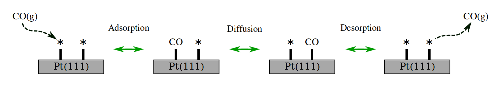
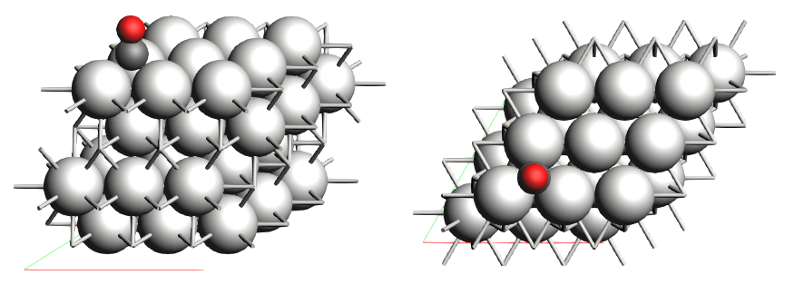
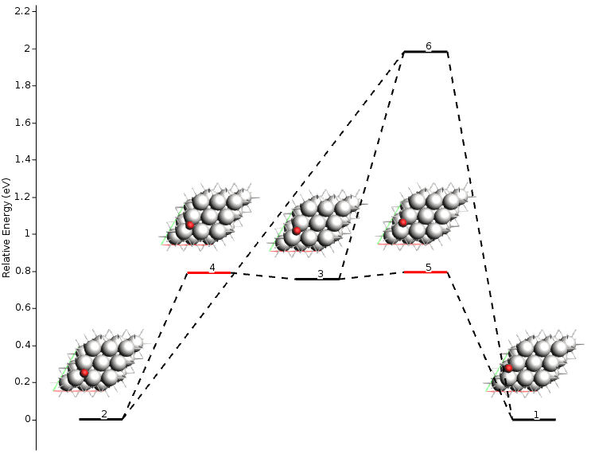
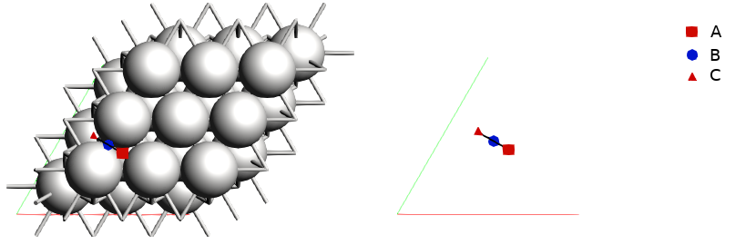
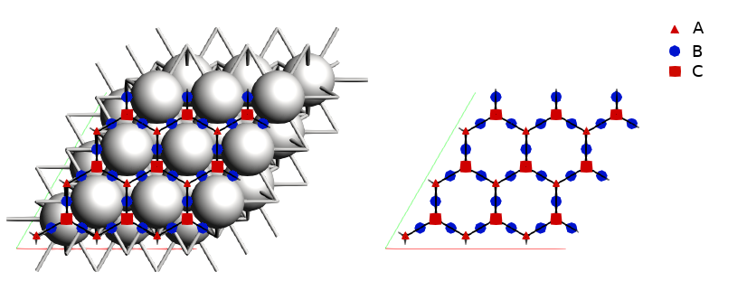
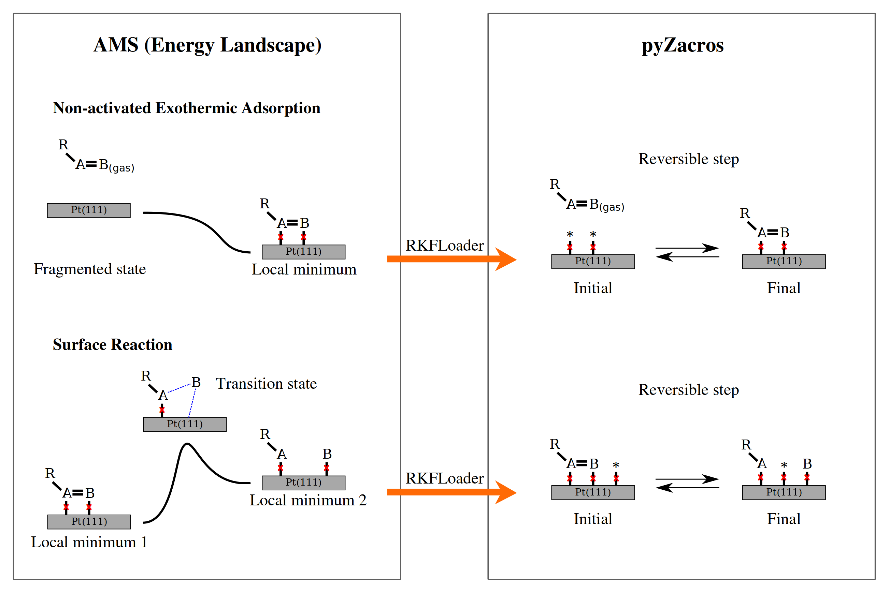
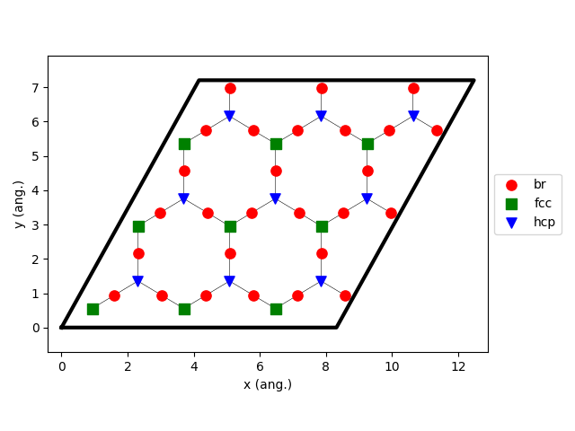
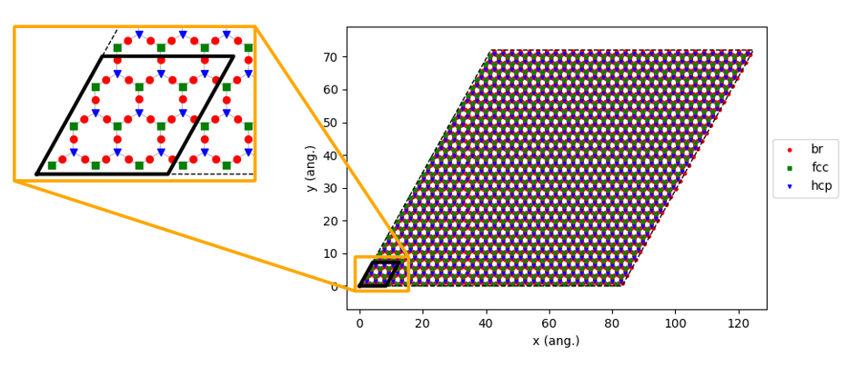
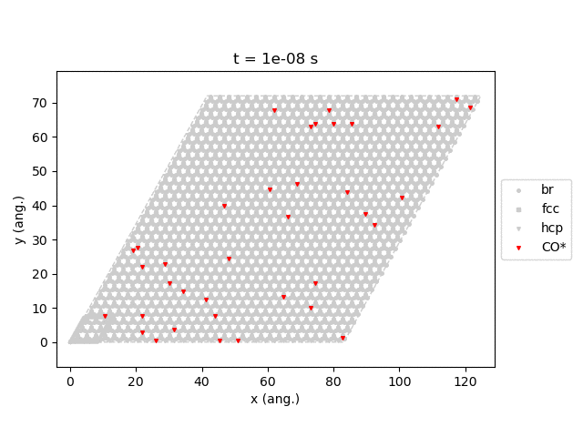
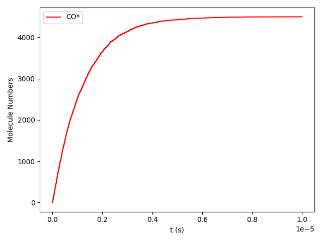

Poisoning of Pt(111) by CO: From Atomistic to Mesoscopic Modeling
-----------------------------------------------------------------

.. note::
  This example script uses computational engines from the Amsterdam Modeling Suite, and you will need a license to run it. Contact license@scm.com for further questions.

  In order to run the example, the ``AMSBIN`` environment variable should be properly set. You can test this by typing ``$AMSBIN/plams -h`` in a terminal: this will print the PLAMS help message. If this is not the case (e.g. you get 'No such file or directory'), you need to set up the environmental variable ``$AMSBIN`` (see the `PLAMS scripting guide <../../Tutorials/WorkflowsAndAutomation/PythonScriptingWithPLAMS.html>`__ for more details).

This example illustrates a procedure for simulating molecular phenomena on catalytic surfaces, starting from an atomic-level description up to a mesoscopic regime in an automated way and with the lowest human supervision possible. We follow the strategy based on the intercommunication and cooperation of three packages: AMS Driver (hereafter AMS for short), EON, and Zacros. The full workflow is carried out in Python.

On a technical level, EON is fully integrated with AMS, being directly accessible through the familiar AMS interface. The PLAMS library is used to access AMS through Python. The Zacros code is coupled through pyZacros, which will generate the required Zacros inputs by directly reading AMS/EON output. pyZacros is also used to manage the Zacros simulations, then parse the output files for subsequent post-processing within the Python environment.

Regarding the chemistry, AMS is used to explore the energy landscape of the system by using specialized atomistic algorithms. This energy landscape is processed in order to determine the binding sites and their connectivity. pyZacros translates this information to clusters, mechanisms, and binding-sites lattices: The building blocks of a Zacros calculation. It then runs the kMC (Kinetic Monte-Carlo) simulations to perform dynamic modeling of adsorption, desorption, surface diffusion, and/or reaction processes. Everything from a simple python script!

The example we show here is a toy model system for the adsorption and diffusion of carbon monoxide on the Pt(111) surface. For this tutorial, we will not be focusing on obtaining an accurate description of the system itself. The CO diffusion will primarily be used as a compact example system for illustrating the automation process. As a simplification, we will not consider any lateral interaction energy corrections among CO molecules at this stage. The simulation described here basically shows the poisoning process of Pt(111) by CO.

This example shows how to conduct a kMC simulation of CO interacting with a Pt(111) surface, starting from its atomic representation. To that aim, we use a 3x3 Pt(111) surface to avoid artificial lateral interactions between the CO and its periodic images. Here, it is essential to point out that both the adsorption sites and the reaction mechanisms will be automatically obtained from the results of the AMS calculation and translated appropriately to Zacros. No pre-defined knowledge of the system is required by the scripts.

The expected mechanisms are sketched in the following figure:

The only necessary information from the system is an initial guess for its geometry. We have used the AMS GUI to generate our CO/Pt(111) system. (If you do not have access to AMS, a link to the generated XYZ file is provided :ref:`below <label-pyzacros-COPt-xyz-download>`.)

We generated a 3x3 Pt(111) surface, put a CO molecule on top of it, and optimized the geometry while keeping the Pt(111) surface frozen. We created two regions for the "adsorbate" and "surface" respectively. The optimized geometry gives a threefold absorption for the CO molecule.

.. _label-pyzacros-COPt-xyz-download:

.. csv-table::
   :header: |co_pt111_xyz|

   "Link to download: :download:`CO_ads+Pt111.xyz <../../../examples/CO+Pt111/CO_ads+Pt111.xyz>`"

.. Note::
  The PES exploration tools used in this tutorial will handle the optimization of the initial geometry. Even if the initial coordinates differ slightly, the script will still generate the same landscape.

  If you prepare the initial geometry yourself, remember to include the regions. This is required for the script to distinguish the adsorbate. It is also recommended to orient the Pt surface in order to maximize its symmetry. In the provided XYZ file, the Pt surface orientation belongs to the P-3m1 (164) space group. AMS is able to exploit this symmetry to reduce the required number of calculations.

The full example script can be obtained through the following link: :download:`CO+Pt111.py <../../../examples/CO+Pt111/CO+Pt111.py>`

If you have AMS installed, you can use the included Python environment to run the script:

.. code-block:: none

   $ amspython CO+Pt111.py

Hereafter, we briefly explain the different sections of the script.

The script starts as follows:

.. code-block:: python
  :linenos:

  import scm.plams
  import scm.pyzacros

  mol = scm.plams.Molecule( 'CO_ads+Pt111.xyz' )

  scm.plams.init()

Firstly we load the required Python libraries: PLAMS and pyZacros (lines 1-2). Then, we create a PLAMS molecule using the XYZ geometry file we provided above (line 4). Take note that this molecule automatically includes the information about regions that are described in the XYZ file. Finally, we start the PLAMS environment (line 6).

It is convenient to divide our script into four sections for clarity:

+ In the first section (:ref:`getting_energy_landscape`), we will obtain the symmetry-irreducible energy landscape for this system, which will indirectly allow us to define the associated reaction mechanisms and the cluster expansion Hamiltonian.

+ In the second section (:ref:`getting_kmc_lattice`), we will get the kMC lattice, which requires applying the symmetry operators of the Pt surface.

+ In the third section (:ref:`generating_pyzacros_objects`), we will use this information to set up the pyZacros simulation.

+ In the fourth section (:ref:`running_pyzacros_simulation`), we run the kMC simulation itself.

.. _getting_energy_landscape:

Exploring the Energy Landscape
==============================

This section aims to get the energy landscape of the system. By exploiting the symmetry of the system, we are able to significantly reduce the computational effort of the calculation and simplify the analysis of the obtained results. This is achieved using the `PESExploration <../../AMS/Tasks/PES_Exploration.html>`__ module in AMS:

.. code-block:: python
  :linenos:
  :lineno-start: 8

  engine_sett = scm.plams.Settings()
  engine_sett.input.ReaxFF.ForceField = 'CHONSFPtClNi.ff'
  engine_sett.input.ReaxFF.Charges.Solver = 'Direct'

  sett_ads = scm.plams.Settings()
  sett_ads.input.ams.Constraints.FixedRegion = 'surface'
  sett_ads.input.ams.Task = "PESExploration"
  sett_ads.input.ams.PESExploration.Job = 'ProcessSearch'
  sett_ads.input.ams.PESExploration.RandomSeed = 100
  sett_ads.input.ams.PESExploration.NumExpeditions = 30
  sett_ads.input.ams.PESExploration.NumExplorers = 4
  sett_ads.input.ams.PESExploration.SaddleSearch.MaxEnergy = 2.0
  sett_ads.input.ams.PESExploration.DynamicSeedStates = 'T'
  sett_ads.input.ams.PESExploration.CalculateFragments = 'T'
  sett_ads.input.ams.PESExploration.StatesAlignment.ReferenceRegion = 'surface'
  sett_ads.input.ams.PESExploration.StructureComparison.DistanceDifference = 0.2
  sett_ads.input.ams.PESExploration.StructureComparison.NeighborCutoff = 2.4
  sett_ads.input.ams.PESExploration.StructureComparison.EnergyDifference = 0.05
  sett_ads.input.ams.PESExploration.StructureComparison.CheckSymmetry = 'T'
  sett_ads.input.ams.PESExploration.BindingSites.Calculate = 'T'
  sett_ads.input.ams.PESExploration.BindingSites.DistanceDifference = 0.1

  job = scm.plams.AMSJob(name='pes_exploration', molecule=mol, settings=sett_ads+engine_sett)
  results_ads = job.run()

  energy_landscape = results_ads.get_energy_landscape()
  print(energy_landscape)

Lines 8-10 enable the `ReaxFF <../../ReaxFF/index.html>`__ engine. We use the CHONSFPtClNi force field, which has been specially designed to study the surface oxidation of Pt(111).

Lines 12-28 specify the PESExploration settings. This task generates the critical points that compose the energy landscape.

The positions of the Pt surface atoms are frozen (line 13). The ProcessSearch method is used to find the escape mechanisms from the different states (line 15), distributed in 10 expeditions with 4 explorers each (lines 17-18), allowing transition state crossing within a 2 eV energy window (line 19).
Any newfound local minimum is used as the origin of a new expedition (line 20). For the definitive set of local minima, a geometry optimization of the corresponding independent fragments (CO and Pt surface) is carried out in order to include the gas-phase configurations in the energy landscape (line 21).

For the structure comparison, we establish that the structures are considered the same if their interatomic distances are less than 0.2 A with energy differences less than 0.05 eV (lines 23-25). Symmetry-equivalent structures are also filtered out (line 26).

We request the calculation of the binding sites (line 27). A distance threshold of 0.1 A is used when comparing sites (line 28). The site labels are based on the number of neighboring atoms within a distance of 2.4 A (line 24), as a lower value for the ``NeighborCutoff`` may fail to distinguish fcc and hcp sites.

Finally, we create the AMSJob calculation, which requires both the initial molecule and the settings object as input parameters (line 30-31). This calculation should take only a few minutes. Once it has finished, we print out a summary of the energy landscape (lines 33-34). If everything went well, you should see the following output:

.. code-block:: none
  :linenos:

  PLAMS working folder: /home/user/pyzacros/examples/CO+Pt111/plams_workdir
  [06.02|11:22:44] JOB pes_exploration STARTED
  [06.02|11:22:44] JOB pes_exploration RUNNING
  [06.02|11:23:38] JOB pes_exploration FINISHED
  [06.02|11:23:38] JOB pes_exploration SUCCESSFUL
  All stationary points:
  ======================
  State 1: COPt36 local minimum @ -7.65164231 Hartree (found 1 times, results on State-1_MIN)
  State 2: COPt36 local minimum @ -7.65157184 Hartree (found 1 times, results on State-2_MIN)
  State 3: COPt36 local minimum @ -7.62382298 Hartree (found 1 times, results on State-3_MIN)
  State 4: COPt36 transition state @ -7.62254754 Hartree (found 6 times, results on State-4_TS_2-3)
    +- Reactants: State 2: COPt36 local minimum @ -7.65157184 Hartree (found 1 times, results on State-2_MIN)
       Products:  State 3: COPt36 local minimum @ -7.62382298 Hartree (found 1 times, results on State-3_MIN)
       Prefactors: 1.549E+13:2.197E+12
  State 5: COPt36 transition state @ -7.62243092 Hartree (found 6 times, results on State-5_TS_1-3)
    +- Reactants: State 1: COPt36 local minimum @ -7.65164231 Hartree (found 1 times, results on State-1_MIN)
       Products:  State 3: COPt36 local minimum @ -7.62382298 Hartree (found 1 times, results on State-3_MIN)
       Prefactors: 1.575E+13:2.200E+12
  Fragment 1: CO local minimum @ -0.42445368 Hartree (results on Fragment-1)
  Fragment 2: Pt36 local minimum @ -7.15428639 Hartree (results on Fragment-2)
  FragmentedState 1: CO+Pt36 local minimum @ -7.57874007 Hartree (fragments [1, 2])
    +- State 1: COPt36 local minimum @ -7.65164231 Hartree (found 1 times, results on State-1_MIN)
    |  Prefactors: 8.051E+06:1.667E+16
    +- State 2: COPt36 local minimum @ -7.65157184 Hartree (found 1 times, results on State-2_MIN)
    |  Prefactors: 8.051E+06:1.642E+16
    +- State 3: COPt36 local minimum @ -7.62382298 Hartree (found 1 times, results on State-3_MIN)
       Prefactors: 8.051E+06:2.329E+15

From this output information, we can see that the calculation took less than a minute (lines 1-5) and that the obtained energy landscape contains three local minima (lines 8-10), two transition states (lines 11-18), and one fragmented state (lines 21-27). Additional information is also available, including the absolute energies, the connections between local minima and transition states, and the pre-exponential factors. To get a more amicable and interactive visualization of the energy landscape, you can use the AMSmovie tool by executing the following command:

.. code-block:: none

   $ amsmovie plams_workdir/pes_exploration/ams.rkf

.. Note::
  AMSmovie currently only includes non-activated exothermic adsorption (X\ :sub:`gas` + * ⟷ X*) and bi-molecular surface reactions (X*+Y* ⟷ Z*).

To visualize the binding sites you can use AMSinput:

.. code-block:: none

   $ amsinput plams_workdir/pes_exploration/ams.rkf

Note that AMS detected three binding sites, labeled as A, B, and C. In literature, these are commonly labeled as fcc, bridge, and hcp, respectively. These sites were detected automatically without any preconceived information about the system. We will update the labels shortly.

.. _getting_kmc_lattice:

Constructing the kMC Lattice
============================

In the previous section, we obtained both the energy landscape and the associated binding sites in the irreducible symmetry representation. In this section, we are interested in generating the full kMC lattice by using these results.

.. code-block:: python
  :linenos:
  :lineno-start: 36

  sett_bs = sett_ads.copy()
  sett_ads.input.ams.PESExploration.Job = 'BindingSites'
  sett_bs.input.ams.PESExploration.LoadEnergyLandscape.Path= '../pes_exploration'
  sett_bs.input.ams.PESExploration.LoadEnergyLandscape.GenerateSymmetryImages = 'T'
  sett_bs.input.ams.PESExploration.CalculateFragments = 'F'
  sett_bs.input.ams.PESExploration.StructureComparison.CheckSymmetry = 'F'

  job = scm.plams.AMSJob(name='binding_sites', molecule=mol, settings=sett_bs+engine_sett)
  results_bs = job.run()

We start from the settings object of the previous calculation (line 36) and load its energy landscape information (line 38).
Because we do not want to run a new exploration process, the number of expeditions and the number of explorers are both set to 1.

Instead, we request the generation of the symmetry-related images (lines 39-41). The fragment calculation can be disabled to save computational time (line 40). A new AMSJob is then executed, using the same initial molecule and the new settings object (lines 44-45). This calculation creates the images by applying the symmetry operators from the surface to the adsorbate atoms and optimizing the new geometry afterward. Transition states are optimized using the dimer method. The calculation should finish in less then a minute:

.. code-block:: none
  :linenos:

  [06.02|11:23:38] JOB binding_sites STARTED
  [06.02|11:23:38] JOB binding_sites RUNNING
  [06.02|11:23:57] JOB binding_sites FINISHED
  [06.02|11:23:57] JOB binding_sites SUCCESSFUL

Using AMSinput to visualize the binding sites:

.. code-block:: none

   $ amsinput plams_workdir/binding_sites/ams.rkf

We now have the full kMC lattice corresponding to the 3x3 Pt(111) surface, including site connectivity and periodic boundary conditions.

.. _generating_pyzacros_objects:

Generating the pyZacros Objects
===============================

In the preceding sections, we have obtained the energy landscape and the binding site lattice. These results have to be post-processed to generate the cluster expansion Hamiltonian, the reaction mechanism, and the extended lattice for the Zacros simulation. pyZacros offers a way to do this through the ``RKFLoader``. This class takes PLAMS output and translates it into the required pyZacros objects: ``Mechanism``, ``ClusterExpansion``, and ``Lattice``. The following figure is a schematic representation of reaction processes as defined in AMS and pyZacros, and how the RKFLoader class translates them from one to the other:

In this figure, red crosses represent the binding sites. A and B are the atoms attached to the binding sites (parent atoms), and R is the remainder of the adsorbed molecule.

The following section of the script shows how to use the RKFLoader object and access the corresponding translated objects in pyZacros. It also shows how to customize the binding site labels:

.. code-block:: python
  :linenos:
  :lineno-start: 46

  loader_ads = scm.pyzacros.RKFLoader( results_ads )
  loader_ads.replace_site_types( ['N33','N221','N331'], ['fcc','br','hcp'] )
  loader_bs = scm.pyzacros.RKFLoader( results_bs )
  loader_bs.replace_site_types( ['N33','N221','N331'], ['fcc','br','hcp'] )

  print(loader_ads.clusterExpansion)
  print(loader_ads.mechanism)
  print(loader_bs.lattice)
  loader_bs.lattice.plot()

The cluster expansion and the mechanism were taken from the symmetry-irreducible energy landscape (lines 46-47) and the lattice from the calculation of the symmetry-generated images (lines 48-49).
Lines 51-53 will print out an overview of these parameters using the Zacros input format.

.. code-block:: none

  energetics

  cluster CO*fcc
    sites 1
    lattice_state
      1 CO* 1
    site_types fcc
    graph_multiplicity 1
    cluster_eng -2.08204e+02
  end_cluster

  ...
  end_energetics

.. code-block:: none

  mechanism

  reversible_step CO*1hcp*2br<->*1hcpCO*2br;(0,1)
    sites 2
    neighboring 1-2
    initial
      1 CO* 1
      2 * 1
    final
      1 * 1
      2 CO* 1
    site_types hcp br
    pre_expon  1.54880e+13
    pe_ratio  7.05110e+00
    activ_eng  7.89792e-01
  end_reversible_step

  ...
  end_mechanism

.. code-block:: none

  lattice periodic_cell
    cell_vectors
      8.31557575    0.00000000
      4.15778787    7.20149984
    repeat_cell 1 1
    n_site_types 3
    site_type_names br fcc hcp
    n_cell_sites 45
    site_types hcp fcc hcp hcp fcc hcp fcc hcp fcc hcp fcc hcp fcc hcp ...
    site_coordinates
      0.07278720    0.07705805
      0.18391338    0.18801095
      0.07278720    0.41039138
      0.40612054    0.07705805
  ...
      9-26  self
      7-24  self
      11-30  self
    end_neighboring_structure
  end_lattice

Line 54 is used to visualize the lattice:

kMC simulations typically use a larger lattice compared to DFT in order to avoid symmetry-induced biases in the surface structures and to improve sampling statistics. Here, we choose to increase the lattice size by creating a 10x10 supercell:

.. code-block:: python
  :linenos:
  :lineno-start: 56

  loader_bs.lattice.set_repeat_cell( (10,10) )
  loader_bs.lattice.plot()

.. _running_pyzacros_simulation:

Running the pyZacros Simulation
===============================

At this point, we finally have all the ingredients we need for our kMC simulation. The following section of the code specifies the simulation conditions and starts Zacros:

.. code-block:: python
  :linenos:
  :lineno-start: 59

  settings = scm.pyzacros.Settings()
  settings.random_seed = 10
  settings.temperature = 273.15
  settings.pressure = 1.01325
  settings.molar_fraction.CO = 0.1

  dt = 1e-8
  settings.max_time = 1000*dt
  settings.snapshots = ('logtime', dt, 3.5)
  settings.species_numbers = ('time', dt)

  job = scm.pyzacros.ZacrosJob( name='zacros_job', lattice=loader_bs.lattice,
                                    mechanism=loader_ads.mechanism,
                                    cluster_expansion=loader_ads.clusterExpansion,
                                    settings=settings )
  results_pz = job.run()

We have used standard conditions for temperature (273.15 K; line 61) and pressure (1 atm; line 62) with a molar fraction of ``0.1`` for the CO in the gas phase. The simulation will run for 10 µs of kMC time (line 66), writing snapshots of the lattice state at 0.01, 0.035, 0.123, 0.429, 1.5, and 5.25 µs (line 67, using the ``logtime`` option), and saving information about the number of species every 0.01 µs (line 68). Note that by default, pyZacros will start the simulation with an empty lattice.

Lines 70-74 are used to start the Zacros job using the pyZacros objects loaded earlier. This simple simulation should finish in less than a minute:

.. code-block:: none
  :linenos:

  [06.02|16:08:46] JOB zacros_job STARTED
  [06.02|16:08:46] JOB zacros_job RUNNING
  [06.02|16:08:47] JOB zacros_job FINISHED
  [06.02|16:08:47] JOB zacros_job SUCCESSFUL

Similar to the preceding tutorials, we can now visualize the output of the simulation before finally closing the PLAMS environment.

.. code-block:: python
  :linenos:
  :lineno-start: 76

  if job.ok():
      results_pz.plot_lattice_states( results_pz.lattice_states() )
      results_pz.plot_molecule_numbers( ["CO*"] )

  scm.plams.finish()

Line 77 will generate snapshots of the lattice states:

Line 78 will plot the transient number of adsorbed CO molecules:

These results show that the Pt surface gets completely poisoned by CO in around 5 µs. (Note that our lattice has 4500 sites.)

In order to obtain a more realistic picture of the CO/Pt(111) system, we could extend this model by including lateral interactions in the cluster expansion. These lateral interactions would reduce the stability of surface CO species, reducing the total coverage. Extension of the reaction mechanism, including e.g. oxidation reactions, would allow study of more complex surface chemistry.

The purpose of this tutorial was to illustrate the setup of automated workflows for connecting atomistic and mesoscopic modeling.
The flexible framework provided by PLAMS and pyZacros allows you to easily modify the scripts to include more complex PESExploration tasks when more extensive mechanisms and energetics are considered.

The :ref:`following tutorial <label-pyzacros-zgb-adp>` will further illustrate how to connect the resulting pyZacros output to macroscale models.
