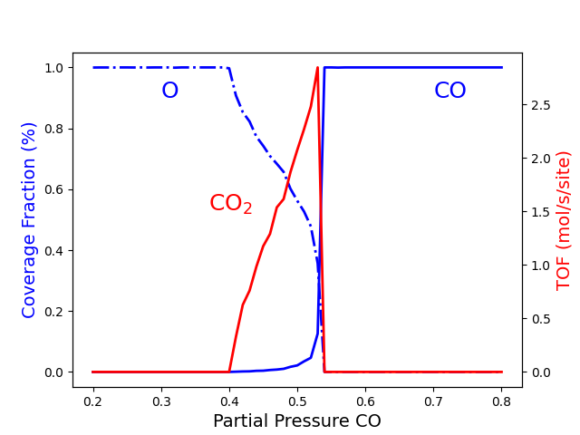
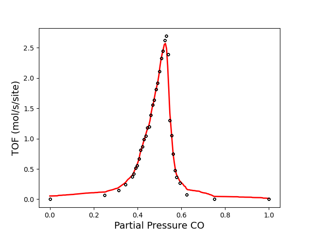

.. |br| raw:: html

       

Examples
========

In this chapter we present example pyZacros scripts covering various applications.

Simple examples
---------------

This section contains some simple tutorial examples to gain a basic understanding of the pyZacros classes.
They are mainly focused on how to translate a typical Zacros input file to the equivalent one in python.
These examples often use short runtimes, making them perfect candidates for exploring, testing, and gaining
experience before moving on to more complex configurations.

.. toctree::
   :maxdepth: 1
   :hidden:

   WaterGasShiftOnPt111.rst
   zgb.rst

.. |example_s1| image:: ../../images/example_WaterGasShiftOnPt111.png
   :scale: 35 %
   :target: WaterGasShiftOnPt111.html

.. |example_s2| image:: ../../images/example_ZGB.gif
   :scale: 35 %
   :target: zgb.html

.. csv-table::
   :header: |example_s1|, |example_s2|
   :align: center

   "Water-gas shift reaction on Pt(111)", "Ziff-Gulari-Barshad model"

Intermediate examples
---------------------

This section contains intermediate-level examples.
The keywords used are fundamentally the same, but their chemistry or
physics may be more complex. These examples may result in longer run
times and require access to higher computational resources.

.. toctree::
   :maxdepth: 1
   :hidden:

   zgb_pts.rst
   zgb_ss.rst

.. |example_i1| image:: ../../images/example_ZGB-PhaseTransitions.png
   :scale: 35 %
   :target: zgb_pts.html

.. |example_i2| image:: ../../images/example_ZGB-SS-nrep1.png
   :scale: 35 %
   :target: zgb_ss.html

.. csv-table::
   :header: |example_i1|, |example_i2|
   :align: center

   "Ziff-Gulari-Barshad model: |br| Phase Transitions |br|", "Ziff-Gulari-Barshad model: |br| Steady State Conditions"

.. toctree::
   :maxdepth: 1
   :hidden:

   zgb_pts_ss
   lh_rrc

.. |example_i4| image:: ../../images/example_LH-ProductionRate.png
   :scale: 35 %
   :target: lh_rrc.html

.. csv-table::
   :header: |example_i3|, |example_i4|
   :align: center

   "Ziff-Gulari-Barshad model: |br| Phase Transitions under Steady |br| State Conditions", "Langmuir-Hinshelwood model: |br| Acceleration by Automated |br| Rescaling of the Rate Constants |br|"

Advanced examples
-----------------

This section contains challenging examples often involving multiphysics throw specific coupling with external codes.
Many of these examples represent industrial problems or show some state-of-the-art validation problems. Switching
to Massively Parallel Processing (MPP) becomes recommended.

.. toctree::
   :maxdepth: 1
   :hidden:

   COPt111
   zgb_pts_sm.rst

.. |example_a1| image:: ../../images/example_CO+Pt111-main.png
   :scale: 54 %
   :target: COPt111.html

.. csv-table::
   :header: |example_a1|, |example_a2|
   :align: center

   "Poisoning of Pt(111) by CO: |br| From atomistic to mesoscopic |br| modeling", "Ziff-Gulari-Barshad model: |br| Phase Transitions and ML-based |br| Surrogate Model |br|"
