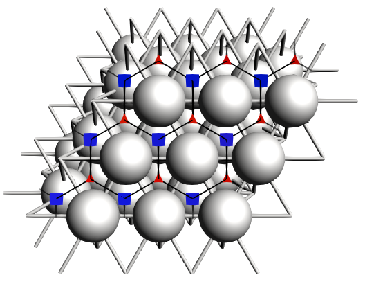
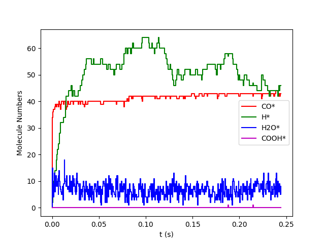
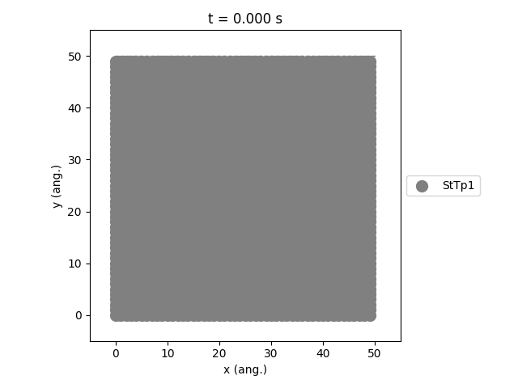
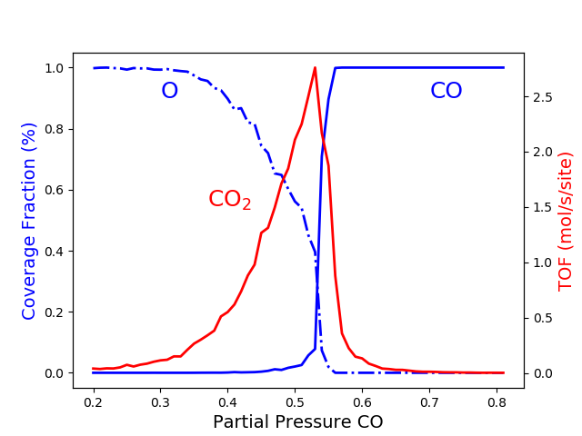

.. |br| raw:: html

       

Examples
========

In this chapter we present example PLAMS scripts covering various applications, from very simple tasks (like running the same calculation for multiple molecules) to more advanced dynamic workflows.

Most of these example scripts use computational engines from the Amsterdam Modeling Suite, and you will need a license to run them. Contact license@scm.com for further questions.

In order to run the examples, the ``AMSBIN`` environment variable should be properly set. You can test this by typing ``$AMSBIN/plams -h`` in a terminal: this should print PLAMS' help message. If this is not the case (e.g. you get 'No such file or directory'), you need to set up the environmental variable ``$AMSBIN`` (see the `Linux Quickstart guide <../../Installation/Linux_Quickstart_Guide.html>`__ for details).

Simple examples
---------------

.. toctree::
   :hidden:

   o_pt111
   co_tutorial
   zgb

.. csv-table::
   :header: |example1|, |example2|, |example3|

   "KMC lattice from first |br| principles. O+Pt(111)", "Water-gas shift reaction on Pt(111)", "Ziff-Gulari-Barshad (ZGB) model"

Advanced examples
-----------------

.. toctree::
   :hidden:

   zgb_pts
   zgb_ss
   zgb_ss_pc

.. csv-table::
   :header: |example4|, |example5|, |example5|

   "ZGB model |br| + Phase Transitions. |br| |br| |br|", "ZGB model |br| + Phase Transitions |br| + Steady-State Operation.  |br| |br|", "ZGB model |br| + Phase Transitions |br| + Steady-State Operation |br| + Parameter Continuation."

