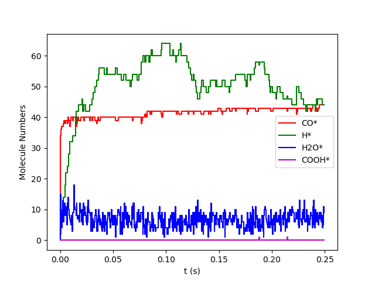

.. |br| raw:: html

       

Examples
========

In this chapter we present example pyZacros scripts covering various applications.

Simple examples
---------------

.. toctree::
   :hidden:

   WaterGasShiftOnPt111
   zgb

.. |example2| image:: ../../images/example_ZGB.gif
   :scale: 35 %
   :target: zgb.html

.. csv-table::
   :header: |example1|, |example2|

   "Water-gas shift reaction on Pt(111)", "Ziff-Gulari-Barshad (ZGB) model"

Advanced examples
-----------------

.. toctree::
   :hidden:

   COPt111
   zgb_pts

.. |example3| image:: ../../images/example_CO+Pt111-main.png
   :scale: 54 %
   :target: COPt111.html

.. |example4| image:: ../../images/example_ZGB-PhaseTransitions.png
   :scale: 32 %
   :target: zgb_pts.html

.. csv-table::
   :header: |example3|, |example4|

   "Poisoning of Pt(111) by CO: |br| From atomistic to mesoscopic |br| modeling.", "ZGB model + Phase Transitions. |br| |br|"
