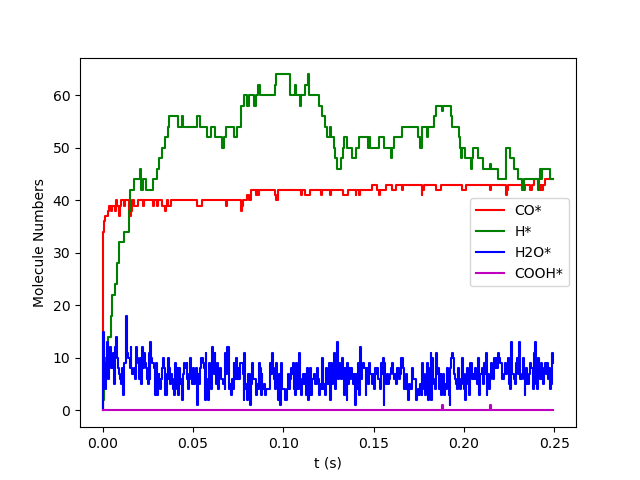
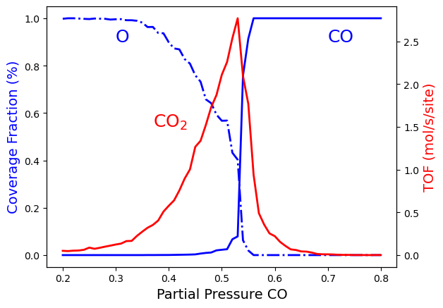
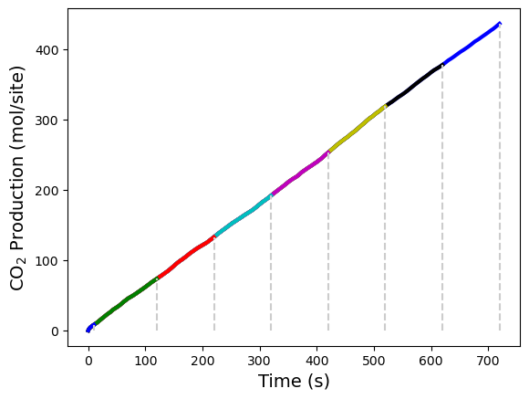
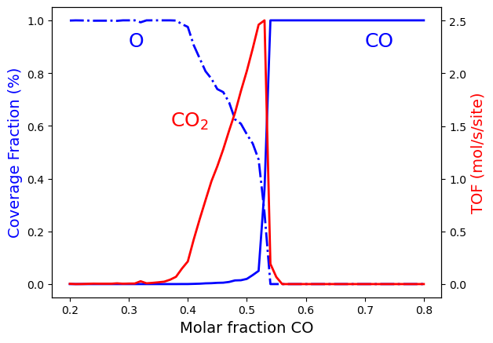
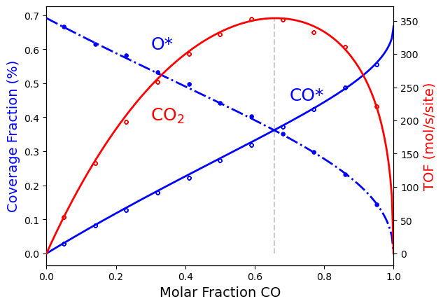
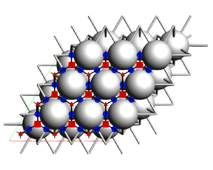

.. |br| raw:: html

       

Examples
========

The following list of examples illustrates how to use pyZacros for running and analyzing kMC simulations.

Simple examples
---------------

This section contains some simple tutorial examples to gain a basic understanding of the pyZacros classes.
They are mainly focused on how to translate a typical Zacros input file to Python.
These examples have short runtimes, making them perfect candidates for exploring, testing, and gaining
experience before moving on to more complex systems.

.. toctree::
   :maxdepth: 1
   :hidden:

   WaterGasShiftOnPt111.rst
   zgb.rst

.. |example_s2| image:: ../../images/example_ZGB.gif
   :scale: 35 %
   :target: zgb.html

.. csv-table::
   :header: |example_s1|, |example_s2|
   :align: center

   "Water-Gas Shift Reaction on Pt(111)", "Ziff-Gulari-Barshad Model"

Intermediate examples
---------------------

This section contains intermediate-level examples.
The scripts have the same structure as the simple examples, but the chemistry /
physics are more complex. These examples may result in longer run
times and require access to higher computational resources.

.. toctree::
   :maxdepth: 1
   :hidden:

   zgb_pts.rst
   zgb_ss.rst

.. csv-table::
   :header: |example_i1|, |example_i2|
   :align: center

   "Ziff-Gulari-Barshad Model: |br| Phase Transitions |br|", "Ziff-Gulari-Barshad Model: |br| Steady State Conditions"

.. toctree::
   :maxdepth: 1
   :hidden:

   zgb_pts_ss
   lh_rrc

.. csv-table::
   :header: |example_i3|, |example_i4|
   :align: center

   "Ziff-Gulari-Barshad Model: |br| Phase Transitions under Steady |br| State Conditions", "Langmuir-Hinshelwood Model: |br| Acceleration by Automated |br| Rescaling of the Rate Constants |br|"

Advanced examples
-----------------

This section contains more complicated scripting examples involving multiphysics by coupling pyZacros with external codes.
These examples represent industrial problems and showcase state-of-the-art validation methods.

.. toctree::
   :maxdepth: 1
   :hidden:

   COPt111
   zgb_pts_sm.rst

.. |example_a2| image:: PhaseTransitions-ADP_improved.png
   :scale: 35 %
   :target: zgb_pts_sm.html

.. csv-table::
   :header: |example_a1|, |example_a2|
   :align: center

   "Poisoning of Pt(111) by CO: |br| From Atomistic to Mesoscopic |br| Modeling", "Ziff-Gulari-Barshad Model: |br| Phase Transitions and ML-based |br| Surrogate Models |br|"
