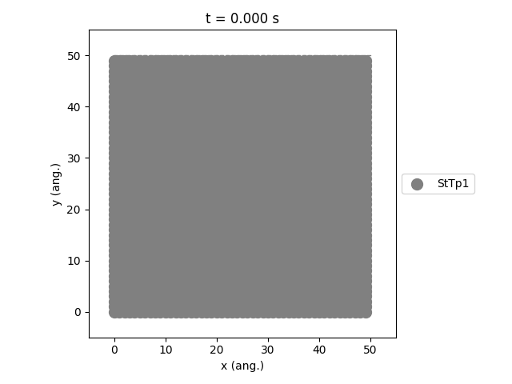

The Ziff-Gulari-Barshad (ZGB) Model
-----------------------------------

In the :ref:`previous tutorial <pyzacros-wgs-tutorial>`, we have shown how the Zacros input files can be translated to pyZacros scripts.
Here, we will show some additional examples for post-processing of the simulation output.

The example script can be downloaded through this link: :download:`ZiffGulariBarshad.py <../../../examples/ZiffGulariBarshad/ZiffGulariBarshad.py>`.

Post-processing Setup
+++++++++++++++++++++

pyZacros scripting can be used to immediately visualize the output of your simulation, enabling automated report generation.
Various built-in functions are :ref:`available <zacrosresults>` to access commonly-used reports.

The basic structure of the script is much the same as in the :ref:`preceding tutorial <pyzacros-wgs-tutorial>`. We start by defining the species, lattice, reactions and simulation settings.
The parameters used for the Ziff-Gulari-Barshad model can be found in the :ref:`models overview <label-pyzacros-zgb-model-overview>`.

We use the ``run()`` call to start the Zacros simulation. A ``results`` object is generated once the simulation completes. This ``results`` object gives us access to the simulation output within Python. For this example, we add a check to make sure that the job has finished without errors (``job.ok``) before proceeding with the analysis.

.. code-block:: python
  :linenos:

  scm.pyzacros.init()
  results = job.run()

  if job.ok():
      # Post-processing & visualization
      results.plot_lattice_states(results.lattice_states())

  scm.pyzacros.finish()

Using the ``plot_lattice_states`` function allows us to generate a **.gif** file showing the transient evolution of the lattice during the kMC simulation. In order to customize your own reports, you can simply add additional function calls to this post-processing block.

.. code-block:: python
  :linenos:

  if job.ok():
      # Post-processing & visualization
      results.plot_molecule_numbers(["CO*", "O*"])
      results.plot_lattice_states(results.lattice_states())

pyZacros can also be used to load results from past jobs. This allows you to modify the visualization script without having to re-run the simulation.

.. code-block:: python
  :linenos:

  job = pz.ZacrosJob.load_external( path="plams_workdir/plamsjob" )
  job.results.plot_lattice_states(job.results.lattice_states())

Running the Simulation
++++++++++++++++++++++

We will now run the example script using Python. For default AMS installations:

``$AMSBIN/amspython WaterGasShiftOnPt111.py``

An overview of the simulation settings will be shown and the jobs starts running.
Once the simulation has completed, a movie will play showing the transient evolution of the lattice.

The ``StTp`` is the default name for a ``SiteType`` in Zacros. When constructing your own :ref:`lattices <lattice>`, you can provide custom labels for the different sites, which will then also update the legend shown in the graph.

.. code-block:: none
  :linenos:

  $ amspython ZiffGulariBarshad.py
  [14.02|17:20:01] PLAMS working folder: /home/user/pyzacros/examples/ZiffGulariBarshad/plams_workdir
  ---------------------------------------------------------------------
  simulation_input.dat
  ---------------------------------------------------------------------
  random_seed         953129
  temperature          500.0
  pressure               1.0

  snapshots                 on time       0.5
  process_statistics        on time       0.01
  species_numbers           on time       0.01
  max_time          25.0

  n_gas_species    3
  gas_specs_names              CO           O2          CO2
  gas_energies        0.00000e+00  0.00000e+00 -2.33700e+00
  gas_molec_weights   2.79949e+01  3.19898e+01  4.39898e+01
  gas_molar_fracs     4.50000e-01  5.50000e-01  0.00000e+00

  n_surf_species    2
  surf_specs_names         CO*        O*
  surf_specs_dent            1         1

  finish
  ---------------------------------------------------------------------
  lattice_input.dat
  ---------------------------------------------------------------------
  lattice default_choice
    rectangular_periodic 1.0 50 50
  end_lattice
  ---------------------------------------------------------------------
  energetics_input.dat
  ---------------------------------------------------------------------
  energetics

  cluster CO*-0
    sites 1
    lattice_state
      1 CO* 1
    site_types 1
    graph_multiplicity 1
    cluster_eng -1.30000e+00
  end_cluster

  cluster O*-0
    sites 1
    lattice_state
      1 O* 1
    site_types 1
    graph_multiplicity 1
    cluster_eng -2.30000e+00
  end_cluster

  end_energetics
  ---------------------------------------------------------------------
  mechanism_input.dat
  ---------------------------------------------------------------------
  mechanism

  step *-0:CO-->CO*-0
    gas_reacs_prods CO -1
    sites 1
    initial
      1 * 1
    final
      1 CO* 1
    site_types 1
    pre_expon  1.00000e+01
    activ_eng  0.00000e+00
  end_step

  step *_0-0,*_1-0:O2-->O*_0-0,O*_1-0;(0,1)
    gas_reacs_prods O2 -1
    sites 2
    neighboring 1-2
    initial
      1 * 1
      2 * 1
    final
      1 O* 1
      2 O* 1
    site_types 1 1
    pre_expon  2.50000e+00
    activ_eng  0.00000e+00
  end_step

  step CO*_0-0,O*_1-0-->*_0-0,*_1-0:CO2;(0,1)
    gas_reacs_prods CO2 1
    sites 2
    neighboring 1-2
    initial
      1 CO* 1
      2 O* 1
    final
      1 * 1
      2 * 1
    site_types 1 1
    pre_expon  1.00000e+20
    activ_eng  0.00000e+00
  end_step

  end_mechanism
  [14.02|17:29:40] JOB plamsjob STARTED
  [14.02|17:29:40] JOB plamsjob RUNNING
  [14.02|17:29:41] JOB plamsjob FINISHED
  [14.02|17:29:41] JOB plamsjob SUCCESSFUL
  [14.02|17:32:01] PLAMS run finished. Goodbye
