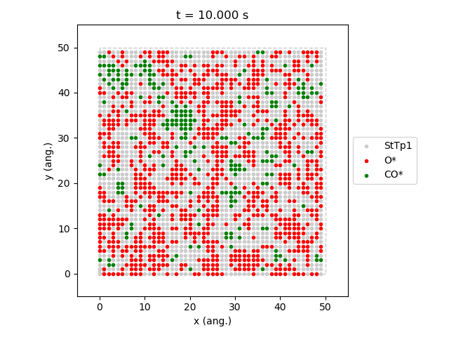
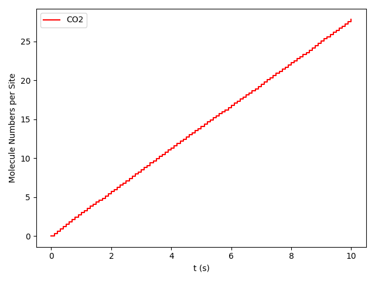
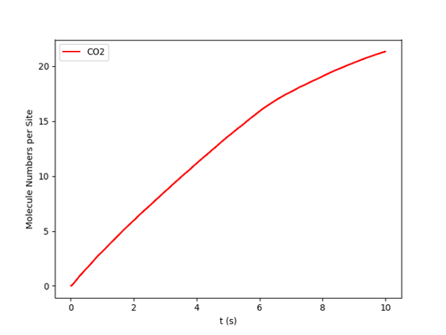
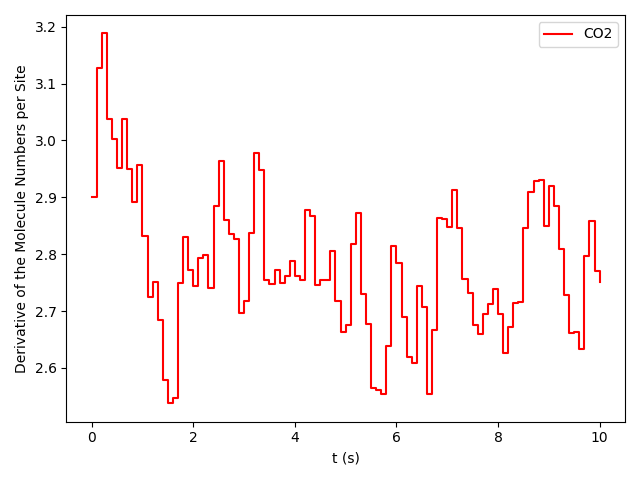
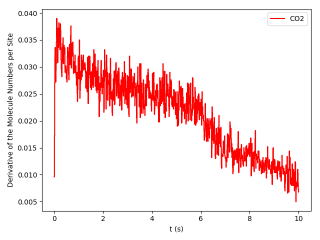

.. |br| raw:: html

       

Phase Transitions in the ZGB model.
-----------------------------------

This example is inspired in the seminal paper: Kinetic Phase Transitions in an Irreversible Surface-Reaction Model by
Robert M. Ziff, Erdagon Gulari, and Yoav Barshad in 1986 (`Phys. Rev. Lett. 56, 25 <https://journals.aps.org/prl/abstract/10.1103/PhysRevLett.56.2553>`_).
This paper is the origin of the ZGB model we have been discussing above. While the model leaves out many important steps of the real system, it exhibits interesting steady-state off-equilibrium behavior and two types of phase transitions, which actually occur in real systems. Please refer to the original paper for more details. In this example, we will analyze the effect of changing the composition of the gas phase, namely partial pressures for O\ :sub:`2` and CO, in the CO\ :sub:`2` Turnover frequency (TOF).

You can download the full example script following this link :download:`ZiffGulariBarshad-PhaseTransitions.py <../../../examples/ZiffGulariBarshad/PhaseTransitions.py>`  and execute it with the following command:

.. code-block:: none

   $ amspython ZiffGulariBarshad-PhaseTransitions.py

The first part of the script consists of the definition of the system (see :ref:`code <code_def_sys>`). Species, lattice,
cluster expansion, and mechanisms are defined. This is identical to the :ref:`use case system <use_case_model_zgb>`
described along the :ref:`Components overview section<components_overview>`. Thus, please refer to this section for details.

.. _code_def_sys:
.. code-block:: python
  :caption: **Code: Definition of the System**
  :linenos:

  # Gas-species:
  CO_gas = pz.Species("CO")
  O2_gas = pz.Species("O2")
  CO2_gas = pz.Species("CO2", gas_energy=-2.337)

  # Surface species:
  s0 = pz.Species("*", 1)
  CO_ads = pz.Species("CO*", 1)
  O_ads = pz.Species("O*", 1)

  # Lattice setup:
  lattice = pz.Lattice( lattice_type=pz.Lattice.RECTANGULAR,
                            lattice_constant=1.0, repeat_cell=[50,50] )

  # Cluster Expansion:
  CO_point = pz.Cluster(species=[CO_ads], cluster_energy=-1.3)
  O_point = pz.Cluster(species=[O_ads], cluster_energy=-2.3)

  cluster_expansion = [CO_point, O_point]

  # Mechanism:
  CO_adsorption = pz.ElementaryReaction(initial=[s0,CO_gas],
                                        final=[CO_ads],
                                        reversible=False,
                                        pre_expon=10.0,
                                        activation_energy=0.0)

  O2_adsorption = pz.ElementaryReaction(initial=[s0,s0,O2_gas],
                                        final=[O_ads,O_ads],
                                        neighboring=[(0, 1)],
                                        reversible=False,
                                        pre_expon=2.5,
                                        activation_energy=0.0)

  CO_oxidation = pz.ElementaryReaction(initial=[CO_ads, O_ads],
                                       final=[s0, s0, CO2_gas],
                                       neighboring=[(0, 1)],
                                       reversible=False,
                                       pre_expon=1.0e+20,
                                       activation_energy=0.0)

  mechanism = [CO_adsorption, O2_adsorption, CO_oxidation]

The second part corresponds to the calculations settings (see :ref:`code <code_settings>`). It starts with the line ``scm.pyzacros.init()``, which initializes the pyZacros and PLAMS environment. Then, in lines 3 to 7, we configure the parallel execution of the calculations. These lines mean running as many zacros jobs simultaneously as many CPUs are on the system. In particular, line 6 establishes that only one processor will be used for each zacros instance. Lines 9 to 18 are fundamentally the same used in the :ref:`use case system <use_case_model_zgb>` described along the :ref:`Components overview section<components_overview>`. Thus, please refer to this section for details.

.. _code_settings:
.. code-block:: python
  :caption: **Code: Calculation Settings**
  :linenos:

  scm.pyzacros.init()

  # Parallel Settings: Run as many job simultaneously as there are cpu on the system
  maxjobs = multiprocessing.cpu_count()
  scm.plams.config.default_jobrunner = scm.plams.JobRunner(parallel=True, maxjobs=maxjobs)
  scm.plams.config.job.runscript.nproc = 1
  print('Running up to {} jobs in parallel simultaneously'.format(maxjobs))

  # Calculation Settings:
  sett = pz.Settings()
  sett.molar_fraction.CO = 0.45
  sett.molar_fraction.O2 = 0.55
  sett.random_seed = 953129
  sett.temperature = 500.0
  sett.pressure = 1.0
  sett.snapshots = ('time', 0.5)
  sett.species_numbers = ('time', 0.01)
  sett.max_time = 10.0

The next block executes the zacros calculations  (see :ref:`code <code_run>`). Lines 1-2 define the grid of partial pressures of CO to study. In this case, from 0.2 up to 0.8. Line 4 defines the results list, initially empty. From lines 5 up to 14, we have the loop that submits one zacros calculation for each value of CO partial pressure. First, we establish the composition in the settings object by selecting the partial pressure of CO and O\ :sub:`2` (``sett.molar_fraction.CO`` and ``sett.molar_fraction.O2`` respectively. Notice that we assumed that the gas phase is composed only of CO and O\ :sub:`2`. Thus, x\ :sub:`CO` +x\ :sub:`O_2` =1). Lines 9 to 12 initialize the ZacrosJob, and line 14 collects the corresponding results into the ``results`` list. ``job.run()`` will return a ``ZacrosResults`` object. The full loop will execute all jobs in groups of ``maxjobs`` jobs.

.. _code_run:
.. code-block:: python
  :caption: **Code: Running the Calculations**
  :linenos:

  dx = 0.01
  x_CO = numpy.arange(0.2,0.8,dx)

  results = []
  for x in x_CO:
     sett.molar_fraction.CO = x
     sett.molar_fraction.O2 = 1.0-x

     job = pz.ZacrosJob( settings=sett,
                          lattice=lattice,
                          mechanism=mechanism,
                          cluster_expansion=cluster_expansion )

     results.append( job.run() )

Now we move to analyze the results (see :ref:`code <code_results>`). Lines 1 to 3 defines vectors to store important results. Specifically, the average coverage of O and CO species on the surface (``cf_O`` and ``cf_CO`` respectively) and the turnover frequency (TOF) of CO2 (``TOF_CO2``). The loop starting at line 5 fill these vectors by iterating through each element of ``x_CO``. Line 6 is crucial because it forces to wait for the job to finish and checks if the status is successful. Only if both conditions are successful can it proceed to access the results.

Lines 5 to 11, calculate the coverage fractions using the last five lattice states, and line 13 calculates the TOFs by utilizing the function ``get_TOFs()``. Roughly, the TOF is the slope of the regression line for the number of molecules produced as a function of time (we will go in deeper about this concept in the next example). Lines 15 to 17 just save the calculated values into the results vectors, and line 19 waits for all threads to finish and clean the pyZacros and PLAMS environment. Finally, lines 21 to 26 print the results nicely to standard output.

.. _code_results:
.. code-block:: python
  :caption: **Code: Getting the Results**
  :linenos:

  cf_O = []
  cf_CO = []
  TOF_CO2 = []

  for i,x in enumerate(x_CO):
     if( results[i].ok() ):
        acf = { "O*":0.0, "CO*":0.0 }
        for lattice_state in results[i].lattice_states(last=5):
           fractions = lattice_state.coverage_fractions()
           acf["O*"] += fractions["O*"]/5
           acf["CO*"] += fractions["CO*"]/5

        TOFs,_,_ = results[i].get_TOFs()

        cf_O.append( acf["O*"] )
        cf_CO.append( acf["CO*"] )
        TOF_CO2.append( TOFs["CO2"] )

  scm.pyzacros.finish()

  print("----------------------------------------------")
  print("%4s"%"cond", "%8s"%"x_CO", "%10s"%"acf_O", "%10s"%"acf_CO", "%10s"%"TOF_CO2")
  print("----------------------------------------------")

  for i,x in enumerate(x_CO):
     print("%4d"%i,"%8.2f"%x_CO[i],"%10.6f"%cf_O[i],"%10.6f"%cf_CO[i],"%10.6f"%TOF_CO2[i])

If the script work successfully, you would see the following output:

.. _code_output:
.. code-block:: none
  :caption: **Execution: Output**
  :linenos:

  $ amspython ZiffGulariBarshad-PhaseTransitions.py
  [26.11|12:15:51] PLAMS working folder: /home/user/pyzacros/examples/plams_workdir
  Running up to 8 jobs in parallel simultaneously
  [26.11|12:15:51] JOB plamsjob STARTED
  [26.11|12:15:51] JOB plamsjob STARTED
  [26.11|12:15:51] Renaming job plamsjob to plamsjob.002
  [26.11|12:15:51] JOB plamsjob STARTED
  [26.11|12:15:51] Renaming job plamsjob to plamsjob.003
  [26.11|12:15:51] JOB plamsjob STARTED
  [26.11|12:15:51] JOB plamsjob RUNNING
  [26.11|12:15:51] Renaming job plamsjob to plamsjob.004
  [26.11|12:15:51] JOB plamsjob STARTED
  [26.11|12:15:51] JOB plamsjob.002 RUNNING
  ...
  [26.11|12:16:08] JOB plamsjob.057 SUCCESSFUL
  [26.11|12:16:08] JOB plamsjob.056 SUCCESSFUL
  [26.11|12:16:08] JOB plamsjob.058 SUCCESSFUL
  [26.11|12:16:08] JOB plamsjob.059 SUCCESSFUL
  [26.11|12:16:09] JOB plamsjob.060 SUCCESSFUL
  [26.11|12:16:09] JOB plamsjob.061 SUCCESSFUL
  [26.11|12:16:09] JOB plamsjob.062 SUCCESSFUL
  [26.11|12:39:42] PLAMS run finished. Goodbye
  -----------------------------------------
      x_CO      acf_O     acf_CO    TOF_CO2
  -----------------------------------------
      0.20   0.998000   0.000000   0.040744
      0.21   0.999520   0.000000   0.036692
      0.22   1.000000   0.000000   0.042709
      0.23   0.998400   0.000000   0.041491
      0.24   0.997360   0.000000   0.051405
      0.25   0.993360   0.000000   0.074524
      0.26   0.998400   0.000000   0.059448
      0.27   0.997280   0.000000   0.075712
      0.28   0.997440   0.000000   0.085320
      0.29   0.993440   0.000080   0.102368
      0.30   0.993120   0.000000   0.114813
      0.31   0.995040   0.000000   0.120510
      0.32   0.991120   0.000000   0.150822
      0.33   0.988640   0.000000   0.150280
      0.34   0.986640   0.000000   0.210519
      0.35   0.974160   0.000080   0.266200
      0.36   0.961360   0.000240   0.301795
      0.37   0.956160   0.000320   0.341076
      0.38   0.933280   0.000400   0.383555
      0.39   0.925680   0.000320   0.511855
      0.40   0.897760   0.000880   0.551203
      0.41   0.862640   0.002160   0.619353
      0.42   0.867040   0.001280   0.737965
      0.43   0.820560   0.001680   0.881659
      0.44   0.815760   0.002160   0.979467
      0.45   0.743920   0.003680   1.266927
      0.46   0.719840   0.006320   1.311960
      0.47   0.653200   0.011520   1.495406
      0.48   0.648240   0.009360   1.712626
      0.49   0.602320   0.016240   1.847959
      0.50   0.561440   0.020480   2.107661
      0.51   0.540320   0.025440   2.248969
      0.52   0.450880   0.057120   2.500418
      0.53   0.396160   0.078080   2.759625
      0.54   0.073440   0.708800   2.168947
      0.55   0.019040   0.896560   1.873619
      0.56   0.000000   0.998720   0.879270
      0.57   0.000000   1.000000   0.358375
      0.58   0.000000   1.000000   0.225387
      0.59   0.000000   1.000000   0.148030
      0.60   0.000000   1.000000   0.132571
      0.61   0.000000   1.000000   0.085284
      0.62   0.000000   1.000000   0.064224
      0.63   0.000000   1.000000   0.040768
      0.64   0.000000   1.000000   0.036527
      0.65   0.000000   1.000000   0.029231
      0.66   0.000000   1.000000   0.028916
      0.67   0.000000   1.000000   0.022165
      0.68   0.000000   1.000000   0.015293
      0.69   0.000000   1.000000   0.012087
      0.70   0.000000   1.000000   0.011946
      0.71   0.000000   1.000000   0.010444
      0.72   0.000000   1.000000   0.007646
      0.73   0.000000   1.000000   0.006830
      0.74   0.000000   1.000000   0.006555
      0.75   0.000000   1.000000   0.004735
      0.76   0.000000   1.000000   0.004933
      0.77   0.000000   1.000000   0.003422
      0.78   0.000000   1.000000   0.002669
      0.79   0.000000   1.000000   0.003086
      0.80   0.000000   1.000000   0.002969
      0.81   0.000000   1.000000   0.002624

The above results are the final aim of the calculation. However, one can take advantage of python libraries to visualize them. Here, we use matplotlib. Please check the matplotlib documentation for more details at `https://matplotlib.org <https://matplotlib.org>`_. The following lines of code allow visualizing the effect of changing the CO partial pressure on the average coverage of O and CO and the production rate of CO\ :sub:`2`.

.. _code_plot_cov_tof_results:
.. code-block:: python
  :caption: **Code: Visualizing the Coverage and TOF Results**
  :linenos:

  # Coverage and TOF plot
  fig = plt.figure()

  ax = plt.axes()
  ax.set_xlabel('Partial Pressure CO', fontsize=14)
  ax.set_ylabel("Coverage Fraction (%)", color="blue", fontsize=14)
  ax.plot(x_CO, cf_O, color="blue", linestyle="-.", lw=2, zorder=1)
  ax.plot(x_CO, cf_CO, color="blue", linestyle="-", lw=2, zorder=2)
  plt.text(0.3, 0.9, 'O', fontsize=18, color="blue")
  plt.text(0.7, 0.9, 'CO', fontsize=18, color="blue")

  ax2 = ax.twinx()
  ax2.set_ylabel("TOF (mol/s/site)",color="red", fontsize=14)
  ax2.plot(x_CO, TOF_CO2, color="red", lw=2, zorder=5)
  plt.text(0.37, 1.5, 'CO$_2$', fontsize=18, color="red")

  plt.show()

.. _figure_cov_tof_results:
.. image:: ../../images/example_ZGB-PhaseTransitions.png
   :scale: 60 %
   :align: center

This model assumes that when gas-phase molecules of CO and O\ :sub:`2` are adsorbed immediately on empty sites,
and when the 0 and CO occupy adjacent sites, they react immediately. This model is intrinsically irreversible
because the molecules are sticky to their original sites and remain stationary until they are removed by a reaction.
The last figure shows three regions:

1. Oxygen poisoned state, x\ :sub:`CO` <0.32.
2. Reactive state 0.32<x\ :sub:`CO` <0.55.
3. CO poisoned state x\ :sub:`CO` >0.55.

The first transition at x\ :sub:`CO` =0.32 is continuous, and therefore it is of the second order. The second transition at x\ :sub:`CO` =0.55 occurs abruptly, implying that this is of a first-order transition. As you increase the KMC simulation time, the transition becomes more abrupt. We will discuss this effect in the next example.

pyZacros also offers some predefined plot functions that use matplotlib as well. For example, it is possible to see a typical reactive state configuration (x\ :sub:`CO` =0.54) and one in the process of being poisoned by CO (x\ :sub:`CO` =0.55). Just get the last lattice state with the ``last_lattice_state()`` function and visualize it with ``plot()``. See the code and figures below. The state at x\ :sub:`CO` =0.54 is a prototypical steady-state, contrary to the one at x\ :sub:`CO` =0.55, which is otherwise a good example where we can see the two phases coexisting.

.. _code_plot_coverage_zbg_pts:
.. code-block:: python
  :caption: **Code: Visualizing coverage results**
  :linenos:

  # Lattice states for x_CO=0.54 and x_CO=0.55
  results[33].last_lattice_state().plot()
  results[34].last_lattice_state().plot()

.. |latticeState2| image:: ../../images/example_ZGB-PhaseTransitions-ls2.png
   :scale: 50 %

.. csv-table:: **Views of the Catalyst Surface**
   :header: |latticeState1|, |latticeState2|

   "A view of the catalyst surface at |br| partial pressure of CO = 0.54. Steady-state.", "A view of the catalyst surface at |br| partial pressure of CO = 0.55. Non-steady-state."

In the previous paragraph, we introduced the concept of steady-state. However, let's define it slightly more formally. For our study system, the steady-state for a given composition is characterized when the derivative of the CO2 production (TOF) with respect to time is zero and remains so:

.. math::

  \frac{d}{dt}TOF_{\text{CO}_2} = 0, \,\,\text{for all present and future}\,\, t

pyZacros also offers the function ``plot_molecule_numbers()`` to visualize the molecule numbers and its first derivative as a function of time. See code and figures below:

.. _code_plot_mol_num_zgb_pts:
.. code-block:: python
  :caption: **Code: Visualizing Molecule Numbers and Its First Derivative**
  :linenos:

  # Molecule numbers for x_CO=0.54 and x_CO=0.55
  results[33].plot_molecule_numbers( ["CO2"], normalize_per_site=True )
  results[34].plot_molecule_numbers( ["CO2"], normalize_per_site=True )

  # First Derivative. Molecule numbers for x_CO=0.54 and CO=0.55
  results[33].plot_molecule_numbers( ["CO2"], normalize_per_site=True, derivative=True )
  results[34].plot_molecule_numbers( ["CO2"], normalize_per_site=True, derivative=True )

.. _figure_mol_numbers_zgb_pts:
.. csv-table:: **Molecule Numbers and Its First Derivative**
   :header: |molnum1| |br| |dmolnum1|, |molnum2| |br| |dmolnum2|

   "CO\ :sub:`2` production for CO = 0.54. Steady-state", "CO\ :sub:`2` for CO = 0.55. Non-steady-state"

From the figures above, it is clear that we have reached a steady-state for x\ :sub:`CO` =0.54. Notice that the first derivative is approximately constant at 2.7 mol/s/site within a tolerance of 5 mol/s/site. Contrary, this is not the case of x\ :sub:`CO` =0.55, where the first derivative continuously decreases.

As a final note, you can use the following script to visualize the results without running the full calculation:

.. code-block:: python
  :caption: **Code: Visualizing the Results**
  :linenos:

  import scm.pyzacros as pz

  # xCO=0.54
  job = pz.ZacrosJob.load_external( path="plams_workdir/plamsjob.034" )
  job.results.last_lattice_state().plot()
  job.results.plot_molecule_numbers( ["CO2"], normalize_per_site=True )
  job.results.plot_molecule_numbers( ["CO2"], normalize_per_site=True, derivative=True )

  # xCO=0.55
  job = pz.ZacrosJob.load_external( path="plams_workdir/plamsjob.035" )
  job.results.last_lattice_state().plot()
  job.results.plot_molecule_numbers( ["CO2"], normalize_per_site=True )
  job.results.plot_molecule_numbers( ["CO2"], normalize_per_site=True, derivative=True )
