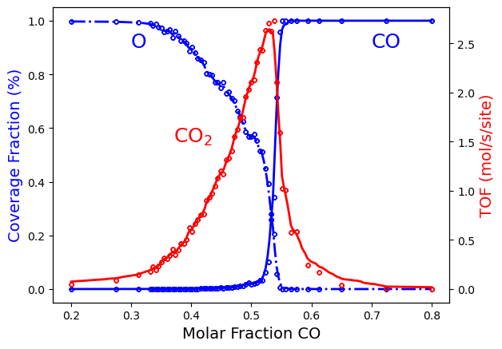
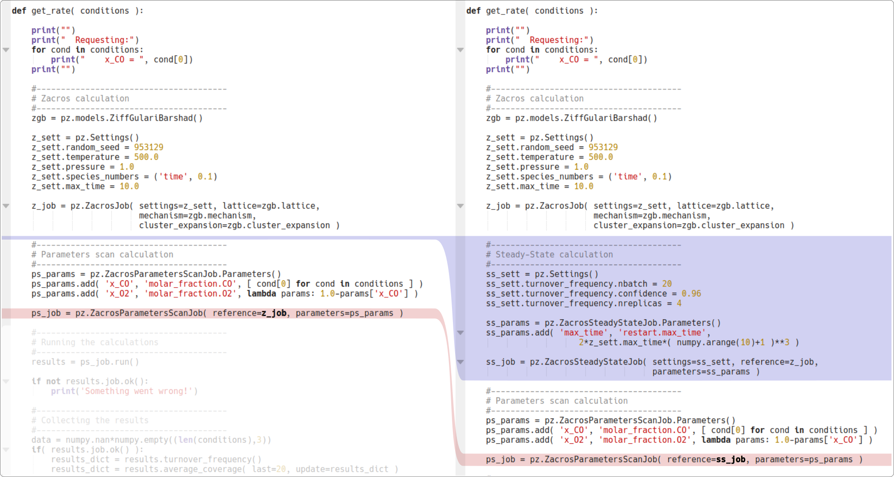

.. |br| raw:: html

       

Ziff-Gulari-Barshad model: Phase Transitions and ML-based Surrogate Model.
==========================================================================

.. Note::
   To follow this tutorial, either:

   * Download :download:`PhaseTransitions-ADP.py <../../../examples/ZiffGulariBarshad/PhaseTransitions-ADP.py>` (run as ``$AMSBIN/amspython PhaseTransitions-ADP.py``).
   * Download :download:`PhaseTransitions-ADP.ipynb <../../../examples/ZiffGulariBarshad/PhaseTransitions-ADP.ipynb>` (see also: how to install `Jupyterlab <../../Scripting/Python_Stack/Python_Stack.html#install-and-run-jupyter-lab-jupyter-notebooks>`__)

.. include:: PhaseTransitions-ADP.rst.include

To improve the Surrogate Model, rerun the calculation with the following parameters for the ADP:

.. code-block:: python
   :emphasize-lines: 2

   adpML = adp.adaptiveDesignProcedure( input_var, output_var, get_rate,
                                        algorithmParams={'dth':0.01,'d2th':0.10},
                                        outputDir=scm.pyzacros.workdir()+'/adp.results',
                                        randomState=10 )

As a result, you should obtain the following figure:

You can also execute the calculation but under steady-state conditions. Take a look at the example :download:`PhaseTransitions-SteadyState-ADP.py <../../../examples/ZiffGulariBarshad/PhaseTransitions-SteadyState-ADP.py>` to see the actual implementation. This can be accomplished simply by making the following changes to the ``get_rate()`` function:

This calculation should not take more than 20 minutes. You should be able to obtain the following figure:

.. image:: PhaseTransitions-SteadyState-ADP.png
   :width: 100 %
   :align: center
