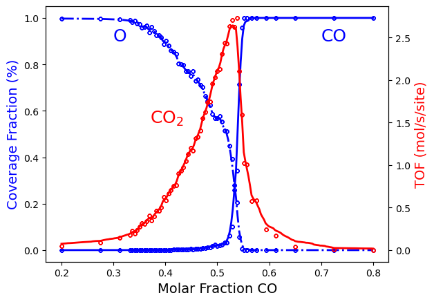
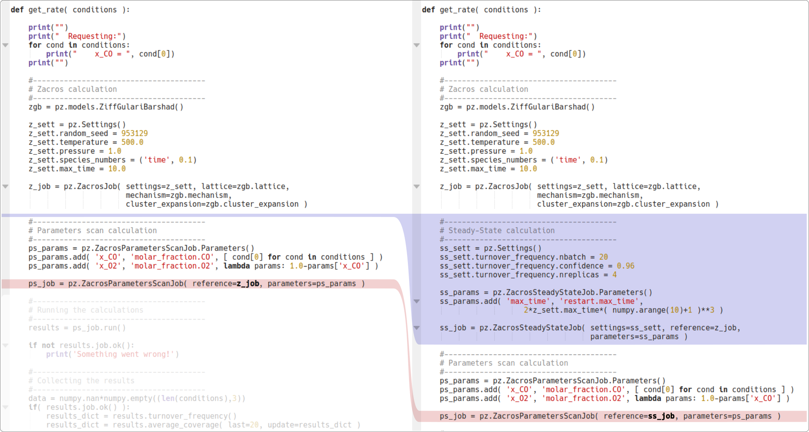
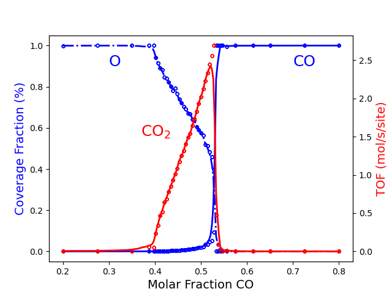

.. |br| raw:: html

       

.. _label-pyzacros-zgb-adp:

Ziff-Gulari-Barshad Model: Phase Transitions and ML-based Surrogate Model
=========================================================================

.. Note::
   To follow this tutorial, either:

   * Download :download:`PhaseTransitions-ADP.py <../../../examples/ZiffGulariBarshad/PhaseTransitions-ADP.py>` (run as ``$AMSBIN/amspython PhaseTransitions-ADP.py``).
   * Download :download:`PhaseTransitions-ADP.ipynb <../../../examples/ZiffGulariBarshad/PhaseTransitions-ADP.ipynb>` (see also: how to install `Jupyterlab <../../Scripting/Python_Stack/Python_Stack.html#install-and-run-jupyter-lab-jupyter-notebooks>`__)

.. include:: PhaseTransitions-ADP.rst.include

Model Refinement
++++++++++++++++

We can alter the ADP parameters to perform a stricter optimization.
The ``dth`` and ``d2th`` parameters are refinement thresholds for the first and second derivatives calculated by the model. When large gradients are encountered in the training set, additional data is generated.
By lowering the ``dth`` and ``d2th`` thresholds, the resolution of the surrogate model can be improved.

Optimization parameters can be specified in the ADP settings. We update our script and re-start the calculation:

.. code-block:: python
   :emphasize-lines: 2

   adpML = adp.adaptiveDesignProcedure( input_var, output_var, get_rate,
                                        algorithmParams={'dth':0.01,'d2th':0.10},
                                        outputDir=scm.pyzacros.workdir()+'/adp.results',
                                        randomState=10 )

This is seen to improve the replication of the narrow features:

Steady-State Model
++++++++++++++++++

We can also perform the model fitting under steady-state conditions. The implementation is provided in the example script :download:`PhaseTransitions-SteadyState-ADP.py <../../../examples/ZiffGulariBarshad/PhaseTransitions-SteadyState-ADP.py>`. We only had to update the ``get_rate()`` function to include the steady-state settings:

This calculation will take around 20 minutes to complete. Once it has finished, we obtain our surrogate model for the steady-state ZGB kinetics:

