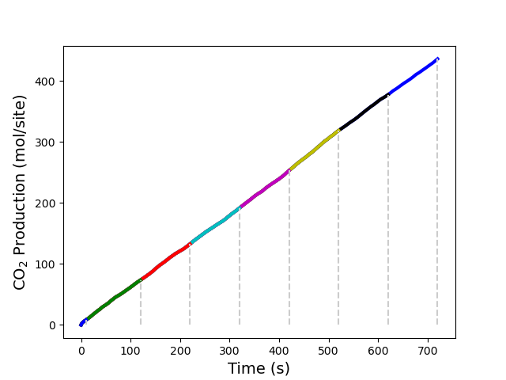
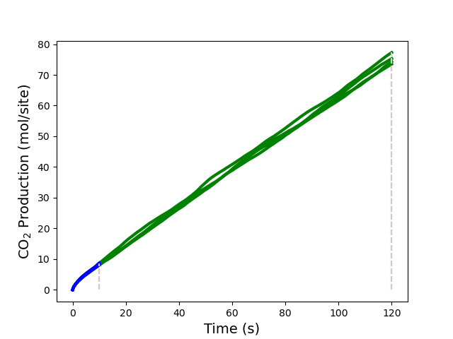

.. |br| raw:: html

       

Ziff-Gulari-Barshad model: Steady State Conditions.
---------------------------------------------------

.. code-block:: none

  [27.09|23:20:26] PLAMS working folder: /home/user/pyzacros/examples/ZiffGulariBarshad/plams_workdir
  [27.09|23:20:26] JOB plamsjob Steady State Convergence: Using nbatch=20,confidence=0.96,ignore_nbatch=1,nreplicas=1
  [27.09|23:20:26] JOB plamsjob STARTED
  [27.09|23:20:26] JOB plamsjob RUNNING
  [27.09|23:20:26] JOB plamsjob/plamsjob_ss_iter000 STARTED
  [27.09|23:20:26] JOB plamsjob/plamsjob_ss_iter000 RUNNING
  [27.09|23:20:26] JOB plamsjob/plamsjob_ss_iter000 FINISHED
  [27.09|23:20:26] JOB plamsjob/plamsjob_ss_iter000 SUCCESSFUL
  [27.09|23:20:26]       species            TOF          error          ratio     conv?
  [27.09|23:20:26]            CO       -0.75520        0.12483        0.16529     False
  [27.09|23:20:26]            O2       -0.39453        0.07267        0.18419     False
  [27.09|23:20:26]           CO2        0.75640        0.12615        0.16678     False
  [27.09|23:20:26] JOB plamsjob Steady State Convergence: NO CONVERGENCE REACHED YET
  [27.09|23:20:26] JOB plamsjob/plamsjob_ss_iter001 STARTED
  [27.09|23:20:26] JOB plamsjob/plamsjob_ss_iter001 RUNNING
  [27.09|23:20:28] JOB plamsjob/plamsjob_ss_iter001 FINISHED
  [27.09|23:20:28] JOB plamsjob/plamsjob_ss_iter001 SUCCESSFUL
  [27.09|23:20:28]       species            TOF          error          ratio     conv?
  [27.09|23:20:28]            CO       -0.59303        0.03157        0.05323     False
  [27.09|23:20:28]            O2       -0.29656        0.01564        0.05274     False
  [27.09|23:20:28]           CO2        0.59301        0.03157        0.05323     False
  [27.09|23:20:28] JOB plamsjob Steady State Convergence: NO CONVERGENCE REACHED YET
  ...
  [27.09|23:20:43]       species            TOF          error          ratio     conv?
  [27.09|23:20:43]            CO       -0.60170        0.02183        0.03628      True
  [27.09|23:20:43]            O2       -0.30081        0.01095        0.03639      True
  [27.09|23:20:43]           CO2        0.60170        0.02183        0.03628      True
  [27.09|23:20:43] JOB plamsjob Steady State Convergence: CONVERGENCE REACHED. DONE!
  [27.09|23:20:43] JOB plamsjob FINISHED
  [27.09|23:20:43] JOB plamsjob SUCCESSFUL
  ---------------------------------------------------------------
      iter    TOF_CO2        max_time   TOF_CO2_error      conv?
           mol/s/site               s      mol/s/site
  ---------------------------------------------------------------
         0    0.75640              20         0.12615      False
         1    0.59301             120         0.03157      False
         2    0.59360             220         0.03311      False
         3    0.59293             320         0.03062      False
         4    0.59345             420         0.02729      False
         5    0.61241             520         0.02564      False
         6    0.60345             620         0.02697      False
         7    0.60170             720         0.02183       True
  [27.09|23:20:43] PLAMS run finished. Goodbye

.. code-block:: none

  [27.09|23:31:34] PLAMS working folder: /home/user/pyzacros/examples/ZiffGulariBarshad/plams_workdir
  [27.09|23:31:34] JOB plamsjob Steady State Convergence: Using nbatch=20,confidence=0.96,ignore_nbatch=1,nreplicas=4
  [27.09|23:31:34] JOB plamsjob STARTED
  [27.09|23:31:34] JOB plamsjob RUNNING
  [27.09|23:31:34] JOB plamsjob/plamsjob_ss_iter000_rep000 STARTED
  [27.09|23:31:34] JOB plamsjob/plamsjob_ss_iter000_rep000 RUNNING
  [27.09|23:31:34] JOB plamsjob/plamsjob_ss_iter000_rep000 FINISHED
  [27.09|23:31:35] JOB plamsjob/plamsjob_ss_iter000_rep000 SUCCESSFUL
  [27.09|23:31:35] JOB plamsjob/plamsjob_ss_iter000_rep001 STARTED
  [27.09|23:31:35] JOB plamsjob/plamsjob_ss_iter000_rep001 RUNNING
  [27.09|23:31:35] JOB plamsjob/plamsjob_ss_iter000_rep001 FINISHED
  [27.09|23:31:35] JOB plamsjob/plamsjob_ss_iter000_rep001 SUCCESSFUL
  [27.09|23:31:35] JOB plamsjob/plamsjob_ss_iter000_rep002 STARTED
  [27.09|23:31:35] JOB plamsjob/plamsjob_ss_iter000_rep002 RUNNING
  [27.09|23:31:35] JOB plamsjob/plamsjob_ss_iter000_rep002 FINISHED
  [27.09|23:31:35] JOB plamsjob/plamsjob_ss_iter000_rep002 SUCCESSFUL
  [27.09|23:31:35] JOB plamsjob/plamsjob_ss_iter000_rep003 STARTED
  [27.09|23:31:35] JOB plamsjob/plamsjob_ss_iter000_rep003 RUNNING
  [27.09|23:31:36] JOB plamsjob/plamsjob_ss_iter000_rep003 FINISHED
  [27.09|23:31:36] JOB plamsjob/plamsjob_ss_iter000_rep003 SUCCESSFUL
  [27.09|23:31:36]    Replica #0
  [27.09|23:31:36]       species            TOF          error          ratio     conv?
  [27.09|23:31:36]            CO       -0.75520        0.12483        0.16529     False
  [27.09|23:31:36]            O2       -0.39453        0.07267        0.18419     False
  [27.09|23:31:36]           CO2        0.75640        0.12615        0.16678     False
  [27.09|23:31:36]    Replica #1
  [27.09|23:31:36]       species            TOF          error          ratio     conv?
  [27.09|23:31:36]            CO       -0.75299        0.09973        0.13245     False
  [27.09|23:31:36]            O2       -0.38992        0.05820        0.14927     False
  [27.09|23:31:36]           CO2        0.75356        0.09957        0.13213     False
  [27.09|23:31:36]    Replica #2
  [27.09|23:31:36]       species            TOF          error          ratio     conv?
  [27.09|23:31:36]            CO       -0.74389        0.09508        0.12782     False
  [27.09|23:31:36]            O2       -0.37939        0.06167        0.16256     False
  [27.09|23:31:36]           CO2        0.74501        0.09607        0.12895     False
  [27.09|23:31:36]    Replica #3
  [27.09|23:31:36]       species            TOF          error          ratio     conv?
  [27.09|23:31:36]            CO       -0.80731        0.09137        0.11318     False
  [27.09|23:31:36]            O2       -0.41425        0.05619        0.13563     False
  [27.09|23:31:36]           CO2        0.80846        0.09294        0.11496     False
  [27.09|23:31:36]    Average
  [27.09|23:31:36]       species            TOF          error          ratio     conv?
  [27.09|23:31:36]            CO       -0.76485        0.09930        0.12984     False
  [27.09|23:31:36]            O2       -0.39452        0.06050        0.15336     False
  [27.09|23:31:36]           CO2        0.76586        0.10011        0.13071     False
  [27.09|23:31:36] JOB plamsjob Steady State Convergence: NO CONVERGENCE REACHED YET
  [27.09|23:31:36] JOB plamsjob/plamsjob_ss_iter001_rep000 STARTED
  [27.09|23:31:36] JOB plamsjob/plamsjob_ss_iter001_rep000 RUNNING
  [27.09|23:31:37] JOB plamsjob/plamsjob_ss_iter001_rep000 FINISHED
  [27.09|23:31:37] JOB plamsjob/plamsjob_ss_iter001_rep000 SUCCESSFUL
  [27.09|23:31:37] JOB plamsjob/plamsjob_ss_iter001_rep001 STARTED
  [27.09|23:31:37] JOB plamsjob/plamsjob_ss_iter001_rep001 RUNNING
  [27.09|23:31:39] JOB plamsjob/plamsjob_ss_iter001_rep001 FINISHED
  [27.09|23:31:39] JOB plamsjob/plamsjob_ss_iter001_rep001 SUCCESSFUL
  [27.09|23:31:39] JOB plamsjob/plamsjob_ss_iter001_rep002 STARTED
  [27.09|23:31:39] JOB plamsjob/plamsjob_ss_iter001_rep002 RUNNING
  [27.09|23:31:40] JOB plamsjob/plamsjob_ss_iter001_rep002 FINISHED
  [27.09|23:31:41] JOB plamsjob/plamsjob_ss_iter001_rep002 SUCCESSFUL
  [27.09|23:31:41] JOB plamsjob/plamsjob_ss_iter001_rep003 STARTED
  [27.09|23:31:41] JOB plamsjob/plamsjob_ss_iter001_rep003 RUNNING
  [27.09|23:31:42] JOB plamsjob/plamsjob_ss_iter001_rep003 FINISHED
  [27.09|23:31:42] JOB plamsjob/plamsjob_ss_iter001_rep003 SUCCESSFUL
  [27.09|23:31:42]    Replica #0
  [27.09|23:31:42]       species            TOF          error          ratio     conv?
  [27.09|23:31:42]            CO       -0.59303        0.03157        0.05323     False
  [27.09|23:31:42]            O2       -0.29656        0.01564        0.05274     False
  [27.09|23:31:42]           CO2        0.59301        0.03157        0.05323     False
  [27.09|23:31:43]    Replica #1
  [27.09|23:31:43]       species            TOF          error          ratio     conv?
  [27.09|23:31:43]            CO       -0.59965        0.03008        0.05016     False
  [27.09|23:31:43]            O2       -0.30027        0.01512        0.05034     False
  [27.09|23:31:43]           CO2        0.59968        0.03010        0.05019     False
  [27.09|23:31:43]    Replica #2
  [27.09|23:31:43]       species            TOF          error          ratio     conv?
  [27.09|23:31:43]            CO       -0.61408        0.02844        0.04632     False
  [27.09|23:31:43]            O2       -0.30743        0.01411        0.04591     False
  [27.09|23:31:43]           CO2        0.61411        0.02845        0.04633     False
  [27.09|23:31:43]    Replica #3
  [27.09|23:31:43]       species            TOF          error          ratio     conv?
  [27.09|23:31:43]            CO       -0.62496        0.03223        0.05158     False
  [27.09|23:31:43]            O2       -0.31290        0.01645        0.05258     False
  [27.09|23:31:43]           CO2        0.62499        0.03225        0.05160     False
  [27.09|23:31:43]    Average
  [27.09|23:31:43]       species            TOF          error          ratio     conv?
  [27.09|23:31:43]            CO       -0.60793        0.01422        0.02339      True
  [27.09|23:31:43]            O2       -0.30429        0.00707        0.02322      True
  [27.09|23:31:43]           CO2        0.60795        0.01423        0.02340      True
  [27.09|23:31:43] JOB plamsjob Steady State Convergence: CONVERGENCE REACHED. DONE!
  [27.09|23:31:43] JOB plamsjob FINISHED
  [27.09|23:31:43] JOB plamsjob SUCCESSFUL
  ---------------------------------------------------------------
      iter    TOF_CO2        max_time   TOF_CO2_error      conv?
           mol/s/site               s      mol/s/site
  ---------------------------------------------------------------
         0    0.76586              20         0.10011      False
         1    0.60795             120         0.01423       True
  [27.09|23:31:43] PLAMS run finished. Goodbye

