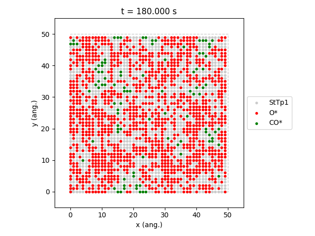
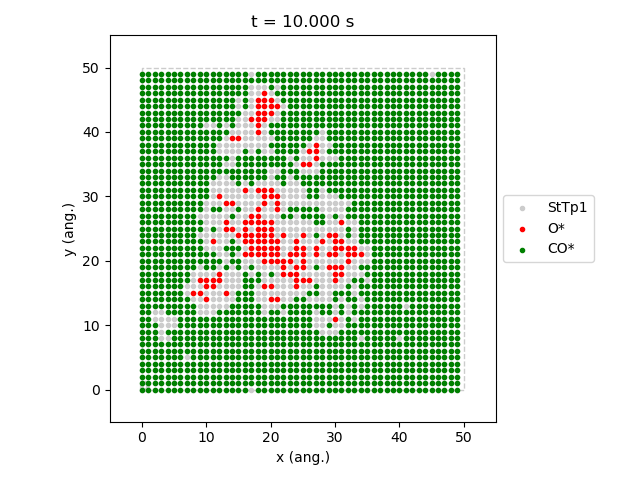
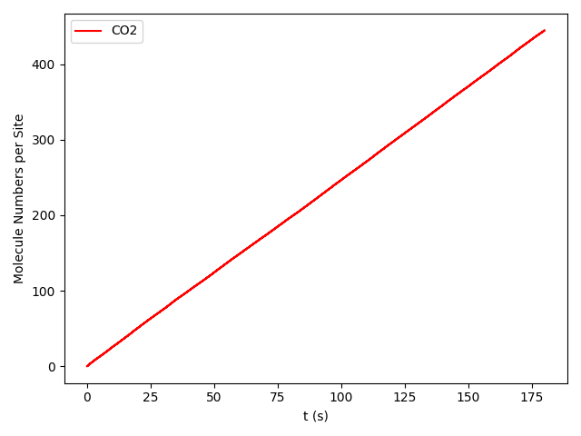
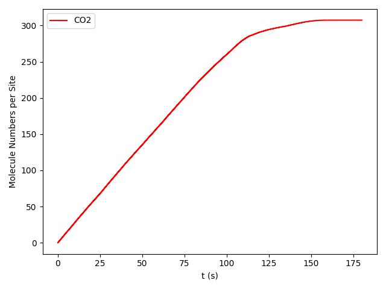
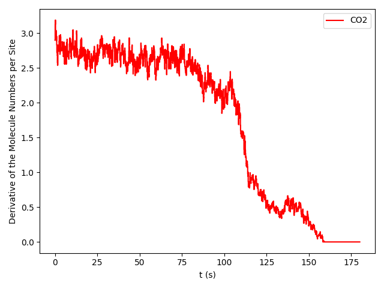

.. |br| raw:: html

       

Phase Transitions in the ZGB model: Stationary Simulation.
----------------------------------------------------------

.. _code_plot_coverage_zbg_ss:
.. code-block:: python
  :caption: **Code: Visualizing coverage results**
  :linenos:

  # Lattice states for x_CO=0.54 and x_CO=0.55
  results[33].last_lattice_state().plot()
  results[34].last_lattice_state().plot()

.. csv-table:: **Views of the Catalyst Surface**
   :header: |latticeState1|, |latticeState2|

   "A view of the catalyst surface at |br| partial pressure of CO = 0.54. Steady-state.", "A view of the catalyst surface at |br| partial pressure of CO = 0.55. Non-steady-state."

.. _code_plot_mol_num_zgb_ss:
.. code-block:: python
  :caption: **Code: Visualizing Molecule Numbers and Its First Derivative**
  :linenos:

  # Molecule numbers for x_CO=0.54 and x_CO=0.55
  results[33].plot_molecule_numbers( ["CO2"], normalize_per_site=True )
  results[34].plot_molecule_numbers( ["CO2"], normalize_per_site=True )

  # First Derivative. Molecule numbers for x_CO=0.54 and CO=0.55
  results[33].plot_molecule_numbers( ["CO2"], normalize_per_site=True, derivative=True )
  results[34].plot_molecule_numbers( ["CO2"], normalize_per_site=True, derivative=True )

.. |dmolnum1| image:: ../../images/example_ZGB-PhaseTransitions-SS-dmn1.png
   :scale: 60 %

.. _figure_mol_numbers_zgb_ss:
.. csv-table:: **Molecule Numbers and Its First Derivative**
   :header: |molnum1| |br| |dmolnum1|, |molnum2| |br| |dmolnum2|

   "CO\ :sub:`2` production for CO = 0.54. Steady-state", "CO\ :sub:`2` for CO = 0.55. Non-steady-state"
