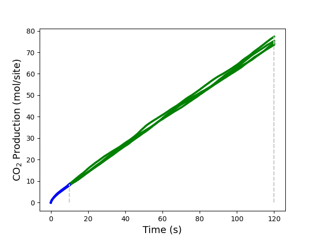

.. |br| raw:: html

       

Ziff-Gulari-Barshad Model: Steady State Conditions
==================================================

.. Note::
   To follow this tutorial, either:

   * Download :download:`SteadyState.py <../../../examples/ZiffGulariBarshad/SteadyState.py>` (run as ``$AMSBIN/amspython SteadyState.py``).
   * Download :download:`SteadyState.ipynb <../../../examples/ZiffGulariBarshad/SteadyState.ipynb>` (see also: how to install `Jupyterlab <../../Scripting/Python_Stack/Python_Stack.html#install-and-run-jupyter-lab-jupyter-notebooks>`__)

.. include:: SteadyState.rst.include

Using Replicas
++++++++++++++

In the example script, we can increase the number of replicas in order to parallelize the steady-state search. We will use 4 replicas here:

.. code-block:: python
  :linenos:

  ss_sett.turnover_frequency.nreplicas = 4

If we run the script again, we will see that the simulation converges much faster:

The calculation now only takes two iterations, rather than the previous eight. Each replica performs a calculation with a different random seed, thereby sampling a different set of states. The TOFs for each iteration are taken as the average over the replicas. This reduces the TOF variance and accelerates the convergence by increasing the number of samples that is generated in each iteration.
