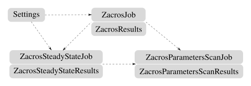

.. _extended_components:

Extended Components
===================

This chapter describes those components (classes) which don't have an equivalent in the Zacros package.
Normally, these classes extend the Zacros functionality, facilitating the scripting process on regularly
required tasks, like running and integrating the results from several Zacros calculations.
The image below shows the currently available extended classes in pyZacros, in addition to the first level
of dependencies with the basic components; :ref:`Settings <settings>`,
:ref:`ZacrosJob <zacrosjob>`, and :ref:`ZacrosResults <zacrosresults>`.

As in the equivalent figure of the basic components, these classes are represented in gray because they are
also extensions of PLAMS.
:ref:`ZacrosParametersScanJob <zacrosparametersscanjob>`/:ref:`ZacrosSteadyStateJob <zacrossteadystatejob>`, and
:ref:`ZacrosParametersScanResults <zacrosparametersscanresults>`/:ref:`ZacrosSteadyStateResults <zacrossteadystateresults>`
are subclasses of the PLAMS classes
`MultiJob <../../plams/components/jobs.html#scm.plams.core.basejob.MultiJob>`_,
and `Results <../../plams/components/results.html>`_ respectively.
In particular, they inherit from PLAMS the robust way of managing the execution of multiple Zacros jobs,
which is the most attractive property of these components.

In a few words, the class :ref:`ZacrosParametersScanJob <zacrosparametersscanjob>` can be used to execute several
calculations in parallel by systematically changing their parameter settings concerning a reference calculation.
On the other side, the class :ref:`ZacrosSteadyStateJob <zacrossteadystatejob>` executes several calculations in serial,
extending the simulated time gradually until reaching the steady state configuration, the convergence
in the production rate of gas species.

.. toctree::
    :maxdepth: 1

    zacrosparametersscanjob
    zacrosparametersscanresults
    zacrossteadystatejob
    zacrossteadystateresults

