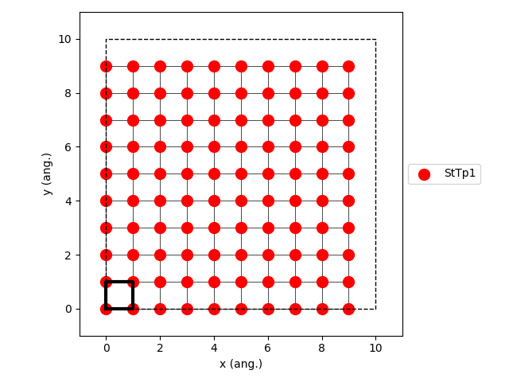
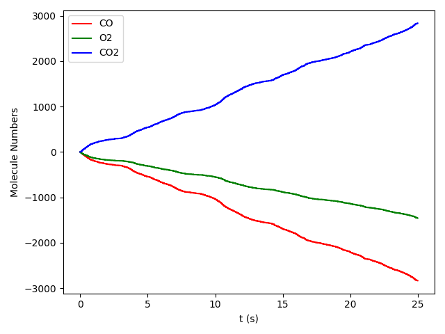
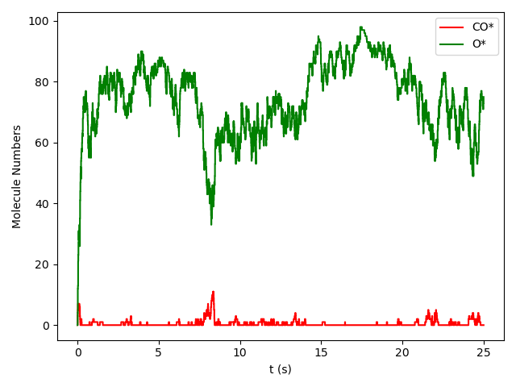

.. _intro:

Introduction
============

What is pyZacros
----------------

pyZacros (Python Library for Automating Zacros Simulation) is a collection of tools that aims to provide a powerful, flexible, and easily extendable Python interface to
`Zacros <https://zacros.org>`_, a Kinetic Monte Carlo software package for simulating molecular phenomena on catalytic surfaces. pyZacros is designed as an extension of the python library `PLAMS <../plams/index.html>`_. Thereby inherits from PLAMS the robust way of managing the inputs file preparation, job execution, file management, and output file processing. Above that, it also offers the possibility of postprocessing the results and building very advanced data workflows.

The normal Zacros workflow has the following steps:

1. First, the subject of the problem (description of the system, and set of the desired simulation parameters) has to be written
   to input text files (i.e. ``energetics_input.dat``, ``mechanism_input.dat``, ``lattice_input.dat``, ``simulation_input.dat``).
2. The ``zacros.x`` program is executed and produces output text files (i.e. ``general_output.txt``, ``procstat_output.txt``,
   ``history_output.txt``, ``specnum_output.txt``, ``lattice_output.txt``).
3. Those output files may contain already the required information or at least contain enough information to get it after
   a postprocessing step.
4. This resultant information may be used to define parameters for further calculations.

pyZacros helps with the automation of all these steps described above directly from a python script and takes responsibility for tiresome and monotonous technical details allowing the user to focus on real science and your problem.

What can be done with pyZacros
------------------------------

As an extension of PLAMS, pyZacros is also designed under the same key design principle ... *flexibility*.
If something (and by something we mean: adjusting an input parameter, executing some program with particular options, extracting a value from output etc.) can be done by hand, it can be done with pyZacros.
The internal structure of the library was designed in a highly modular, especially an object-oriented manner. In particular, there are classes to represent species, clusters, elementary Reactions, among others that are easy to set up and use.

The most important features of pyZacros:

* Preparing, running and examining results of a Zacros jobs from within a single Python script
* Convenient automatic file and folder management
* Running jobs in parallel without a need to prepare a special parallel script
* Integration with popular job schedulers (OGE, SLURM, TORQUE)
* Prevention of multiple runs of the same job
* Easy data transfer between separate runs
* An efficient and simple way for restarting calculation in case of a crash or just to extend the simulation.
* Almost full coverage of all input options and output data in Zacros.
* Visualization and interactive building of the lattice of the system.
* Default plot functions to visualize results like adlayer configurations, process statistics, and species numbers.
* Reconstruction of the pyZacros objects from Zacros calculation which were not managed by pyZacros.

.. _simple_example:

Simple example
--------------

Here we show a simple pyZacros script that reproduces the Zacros tutorial
`Ziff-Gulari-Barshad (ZGB) Model in Zacros <https://zacros.org/tutorials/4-tutorial-1-ziff-gulari-barshad-model-in-zacros>`_.

The ZGB model includes (see the script below):

1. Three gas species: CO, O\ :sub:`2`, and CO\ :sub:`2`. (Lines 5-7)
2. Three surface species: \*, CO\*, O\*. (Lines 10-12)
3. A rectangular lattice with a single site type. (Lines 15-16)
4. Two clusters are included in the cluster-expansion Hamiltonian approach for the energetics. The CO* and O* individual
   adsorbates (without lateral interactions) with 1.3 eV and 2.3 eV, binding energies, respectively. (Lines 20-21)
5. Three irreversible events: non-dissociative adsorption of CO, dissociative adsorption of O2, and fast reaction between
   an O adatom and a CO adsorbate. (Lines 24-31)

.. code-block:: python
   :linenos:

   import scm
   import scm.pyzacros as pz

   # Gas species:
   CO_g = pz.Species("CO")
   O2_g = pz.Species("O2")
   CO2_g = pz.Species("CO2", gas_energy=-2.337)

   # Surface species:
   s0 = pz.Species("*")      # Empty adsorption site
   CO_s = pz.Species("CO*")
   O_s = pz.Species("O*")

   # Lattice setup:
   lattice = pz.Lattice( lattice_type=pz.Lattice.RECTANGULAR,
                         lattice_constant=1.0, repeat_cell=[10,10] )
   lattice.plot()

   # Clusters:
   CO_p = pz.Cluster( species=[CO_s], energy=-1.3 )
   O_p = pz.Cluster( species=[O_s], energy=-2.3 )

   # Elementary Reactions
   CO_ads = pz.ElementaryReaction( initial=[s0, CO_g], final=[CO_s],
                                   reversible=False, pre_expon=10.0, activation_energy=0.0 )

   O2_ads = pz.ElementaryReaction( initial=[s0, s0, O2_g], final=[O_s, O_s], neighboring=[(0, 1)],
                                   reversible=False, pre_expon=2.5, activation_energy=0.0 )

   CO_oxi = pz.ElementaryReaction( initial=[CO_s, O_s], final=[s0, s0, CO2_g], neighboring=[(0, 1)],
                                   reversible=False, pre_expon=1.0e+20, activation_energy=0.0)

   scm.pyzacros.init()

   # Settings:
   sett = pz.Settings()
   sett.temperature = 500.0
   sett.pressure = 1.0
   sett.snapshots = ('time', 5.e-1)
   sett.process_statistics = ('time', 1.e-2)
   sett.species_numbers = ('time', 1.e-2)
   sett.max_time = 25.0
   sett.random_seed = 953129

   sett.molar_fraction.CO = 0.45
   sett.molar_fraction.O2 = 0.55

   myJob = pz.ZacrosJob( settings=sett, lattice=lattice,
                           mechanism=[CO_ads, O2_ads, CO_oxi],
                           cluster_expansion=[CO_p, O_p] )

   results = myJob.run()

   print( "nCO2 = ", results.provided_quantities()["CO2"][-10:] )
   results.plot_molecule_numbers( results.gas_species_names() )
   results.plot_molecule_numbers( results.surface_species_names() )

   scm.pyzacros.finish()

Don't worry if something in the above code is incomprehensible or confusing.
Everything you need to know to understand how pyZacros works and how to write your own scripts is explained
in next chapters of this documentation.

By executing the above script, you are going to see a visual representation of the lattice (see script's line 17) that should
be similar to the image below:

Then, you should see the plot of the number of molecules of each kind as a function of time during the simulation. We have split this information into two Figures for clarity, one for gas-phase species and the other one for surface species, as follows (see script's line 55-56):

During the execution the following information is written to the standard output:

.. code-block:: none
   :linenos:

   [02.11|12:07:12] PLAMS working folder: /home/user/plams_workdir
   [08.02|13:57:45] JOB plamsjob STARTED
   [08.02|13:57:45] JOB plamsjob RUNNING
   [08.02|13:57:45] JOB plamsjob FINISHED
   [08.02|13:57:45] JOB plamsjob SUCCESSFUL
   nCO2 =  [2790, 2790, 2790, 2792, 2792, 2793, 2793, 2795, 2797, 2797]
   [08.02|13:58:05] PLAMS run finished. Goodbye

It indicates that pyZacros created a uniquely named working folder (``plams_workdir``) and then ran the Zacros calculation in a separate
subfolder of the working folder (``plamsjob``). All the files created by each Zacros run are saved in the corresponding subfolder for future reference. However, notice that you can access the results directly from the python script. To illustrate this, see line 54 of the script that produces line 6 in the standard output, which prints the number of CO2 molecules produced in the last ten-time steps of the simulation.
