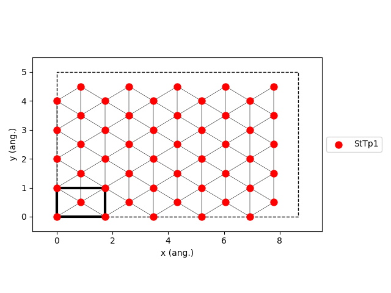

.. |br| raw:: html

       

Langmuir-Hinshelwood Model
--------------------------

The LH model includes the following elementary reactions:

.. math::
   :nowrap:

   \begin{align}
      \text{CO}_{(\text{g})} + \text{*}  & \overset{k_\text{CO}}{\longleftrightarrow} \text{CO}^\text{*} &\qquad \text{'CO_adsorption'} \\
      \text{O}_{2(\text{g})} + 2\text{*} & \overset{k_{\text{O}_2}}{\longleftrightarrow} \text{O}^\text{*} + \text{O}^\text{*}  &\qquad \text{'O_adsorption'}\\
      \text{O}^\text{*} + \text{*} & \overset{k_\text{O}}{\longleftrightarrow} \text{*} + \text{O}^\text{*} &\qquad \text{'O_difussion'}\\
      \text{CO}^\text{*} + \text{*} & \overset{k_\text{CO}}{\longleftrightarrow} \text{*} + \text{CO}^\text{*} &\qquad \text{'CO_difussion'} \\
      \text{CO}^\text{*} + \text{O}^\text{*} & \overset{k_\text{oxi}}{\longleftrightarrow} 2\text{*} + \text{CO}_{2(\text{g})} &\qquad \text{'CO_oxidation'} \\
   \end{align}

.. 1. CO, O\ :sub:`2`, and CO\ :sub:`2`
.. 2. Three surface species: \*, CO\*, O\*. (Lines 10-12)
.. 3. A rectangular lattice with a single site type. (Lines 15-16)
.. 4. Two clusters are included in the cluster-expansion Hamiltonian approach for the energetics. The CO* and O* individual
..    adsorbates (without lateral interactions) with 1.3 eV and 2.3 eV, binding energies, respectively. (Lines 20-21)
.. 5. Three irreversible events: non-dissociative adsorption of CO, dissociative adsorption of O2, and fast reaction between
..    an O adatom and a CO adsorbate. (Lines 24-31)

   Lattice generated using the option ``repeat_cell=(5,5)``
