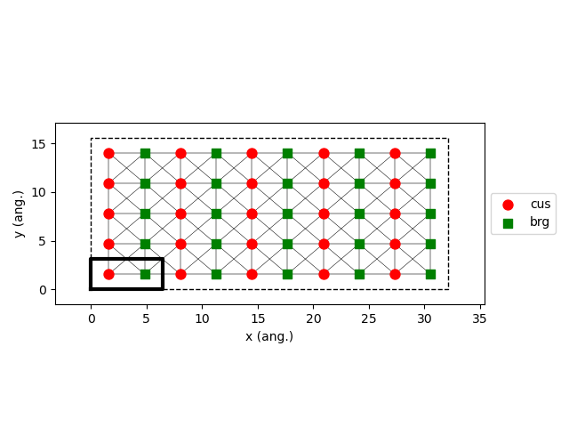

.. |br| raw:: html

       

Reuter-Scheffler Model
----------------------

For more information, see file :download:`ReuterScheffler.py <../../../src/scm/pyzacros/models/ReuterScheffler.py>`.

The RS model includes the following elementary reactions:

.. math::
   :nowrap:

   \begin{align}
      \text{CO}_{(\text{g})} + \text{*-brg}  & \overset{k_\text{CO}^\text{brg}}{\longleftrightarrow} \text{CO}^\text{*}\text{-brg} &\qquad \text{'CO_brg_adsorption'} \\
      \text{CO}_{(\text{g})} + \text{*-cus}  & \overset{k_\text{CO}^\text{cus}}{\longleftrightarrow} \text{CO}^\text{*}\text{-cus} &\qquad \text{'CO_cus_adsorption'} \\[6mm]

      \text{O}_{2(\text{g})} + 2\text{*-brg} & \overset{k_{\text{O}_2}^\text{brg,brg}}{\longleftrightarrow} \text{O}^\text{*}\text{-brg} + \text{O}^\text{*}\text{-brg}  &\qquad \text{'O_brg_adsorption'}\\
      \text{O}_{2(\text{g})} + 2\text{*-cus} & \overset{k_{\text{O}_2}^\text{cus,cus}}{\longleftrightarrow} \text{O}^\text{*}\text{-cus} + \text{O}^\text{*}\text{-cus}  &\qquad \text{'O_cus_adsorption'}\\
      \text{O}_{2(\text{g})} + \text{*-cus} + \text{*-brg} & \overset{k_{\text{O}_2}^\text{cus,brg}}{\longleftrightarrow} \text{O}^\text{*}\text{-cus} + \text{O}^\text{*}\text{-brg}  &\qquad \text{'O_cus_O_brg_adsorption'}\\[6mm]

      \text{CO}^\text{*}\text{-brg} + \text{O}^\text{*}\text{-cus} & \overset{k_\text{oxi}}{\longleftrightarrow} \text{*}\text{-brg} + \text{*}\text{-cus} + \text{CO}_{2(\text{g})} &\qquad \text{'CO_brg_O_cus_oxidation'} \\
      2\text{O}^\text{*}\text{-brg} & \overset{k_\text{oxi}}{\longleftrightarrow} 2\text{*}\text{-brg} + \text{CO}_{2(\text{g})} &\qquad \text{'CO_brg_O_brg_oxidation'} \\
      2\text{O}^\text{*}\text{-cus} & \overset{k_\text{oxi}}{\longleftrightarrow} 2\text{*}\text{-cus} + \text{CO}_{2(\text{g})} &\qquad \text{'CO_cus_O_cus_oxidation'} \\
      \text{CO}^\text{*}\text{-cus} + \text{O}^\text{*}\text{-brg} & \overset{k_\text{oxi}}{\longleftrightarrow} \text{*}\text{-cus} + \text{*}\text{-brg} + \text{CO}_{2(\text{g})} &\qquad \text{'CO_cus_O_brg_oxidation'} \\
   \end{align}

   Lattice generated using the option ``repeat_cell=(5,5)``
