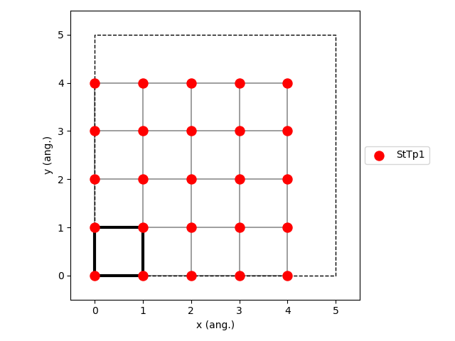

.. |br| raw:: html

       

.. _label-pyzacros-zgb-model-overview:

Ziff-Gulari-Barshad Model
-------------------------

A full overview of the model is provided in: :download:`ZiffGulariBarshad.py <../../../src/scm/pyzacros/models/ZiffGulariBarshad.py>`

The ZGB model includes the following elementary reactions:

.. math::
   :nowrap:

   \begin{align}
      \text{CO}_{(\text{g})} + \text{*}  & \overset{k_\text{CO}}{\longrightarrow} \text{CO}^\text{*} &\qquad \text{CO adsorption} \\
      \text{O}_{2(\text{g})} + 2\text{*} & \overset{k_{\text{O}_2}}{\longrightarrow} \text{O}^\text{*} + \text{O}^\text{*}  &\qquad \text{O2 adsorption}\\
      \text{CO}^\text{*} + \text{O}^\text{*} & \overset{k_\text{oxi}}{\longrightarrow} 2\text{*} + \text{CO}_{2(\text{g})} &\qquad \text{CO oxidation} \\
   \end{align}

   Lattice generated using the option ``repeat_cell=(5,5)``
